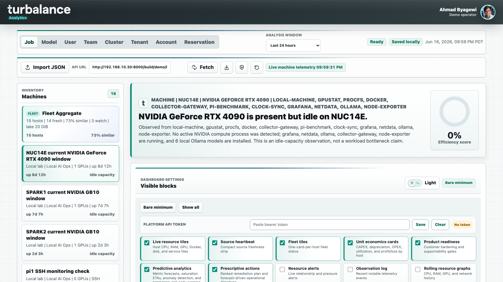
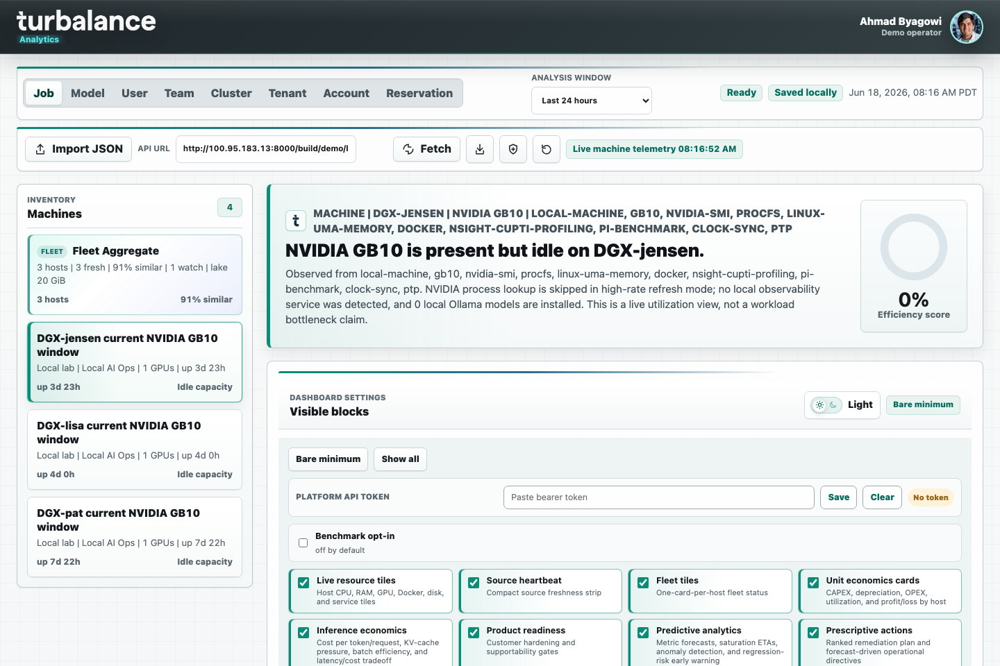
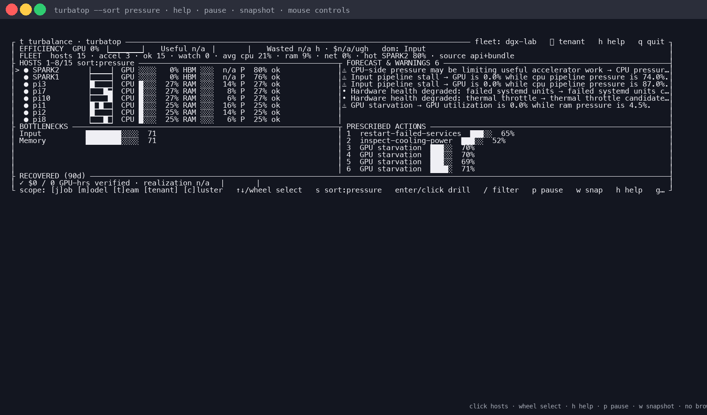
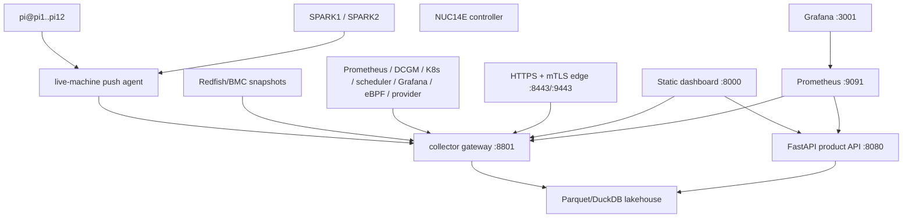
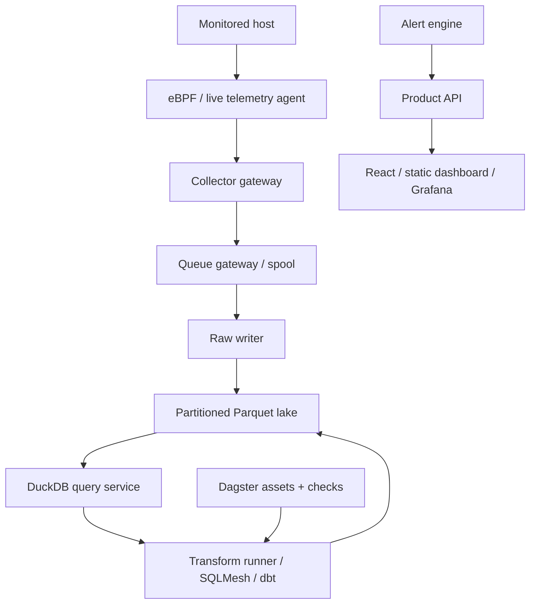
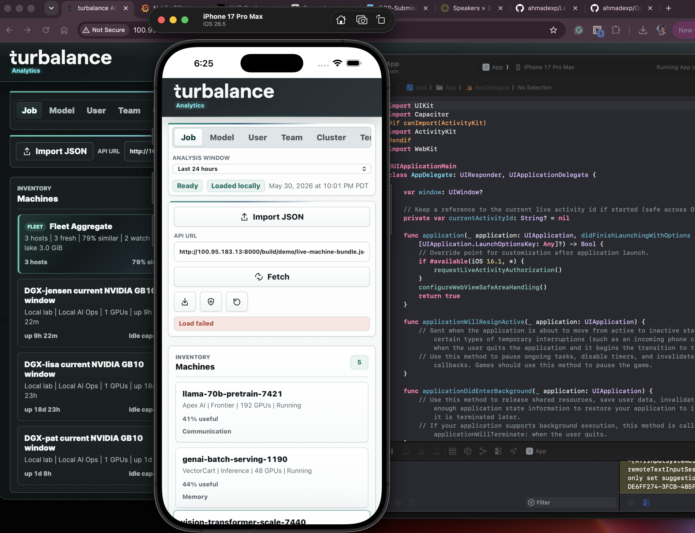

# turbalance Analytics



Live NUC14E desktop view with the profile-aware topbar, live telemetry, machine inventory, and explicit production/demo data boundary state.



Live NUC15/Tailscale desktop view showing the same current-user profile treatment against a different machine bundle.



Mouse-enabled `turbatop` terminal view showing the same live fleet pressure, warnings, and prescribed actions over SSH without a browser.

turbalance Analytics is an operator cockpit for AI infrastructure. It combines live machine telemetry, durable lakehouse telemetry, scheduler/source overlays, GPU observability, Redfish/BMC evidence, system identification, product packaging, and production runbooks into one workflow for finding wasted accelerator time, explaining why it is happening, and proving a change before a customer sees it.

The repo now supports two connected delivery lanes:

- A single-controller bare-metal product appliance for the NUC14E, SPARK1/SPARK2, and 12 Raspberry Pi hosts.
- A fuller lakehouse/Kubernetes production lane with managed storage, image release, mTLS, ExternalSecret, OpenTelemetry, alerting, and go-live gates.

The fastest orientation path is:

- Product appliance and customer pilot workflow: `docs/customer-productization.md`
- Durable data platform and Kubernetes lane: `docs/e2e-data-platform.md`
- Lakehouse operations and production runbooks: `docs/lakehouse-operations.md`
- Bare-metal fleet production notes: `docs/bare-metal-fleet-production.md`
- Redfish/BMC hardware-management bridge: `docs/redfish-integration.md`
- Visual QA checklist: `docs/visual-qa.md`
- Current product appliance deck: `outputs/turbalance-product-current-state.pptx`

## What This Is Now

This repository has moved from a static analytics prototype into a friendly-pilot product appliance plus a production lakehouse lane:

- **Pilot appliance**: a single NUC14E controller for SPARK1, SPARK2, and `pi@pi1` through `pi@pi12`, with HTTPS, mTLS collector edge, API auth, Grafana, Prometheus, live agents, periodic benchmarks, support bundles, releases, rollback, and doctor checks.
- **Analytics cockpit**: static/live dashboard with a profile-aware topbar, host-specific live bundle bootstrap, live resource tiles, SPARK pair comparison, Pi fleet histograms, PTP/NTP/chrony clock offset tracking, system characterization, opportunity analysis, provider lens, evidence packs, dark mode, and block settings.
- **Terminal operator UI**: `turbatop` is a dependency-free Python zipapp for SSH sessions. It renders fleet efficiency, host pressure, forecast warnings, bottlenecks, prescribed actions, recovered savings, multi-page operator panels, a compact efficiency-score rail, btop-style neon terminal chrome, natural host sorting, live-bundle fallback, token-file auth, non-blocking background refresh, help, pause/resume, snapshots, and keyboard plus mouse controls.
- **Source-bundle bridge**: import and backend ingest for Prometheus, DCGM, Kubernetes, scheduler/admission, Grafana, eBPF, Redfish, provider billing/SLO, opportunity exports, OCP Benchmark Commons exports, GPU process/thermal/topology diagnostics, and NCCL traces.
- **Lakehouse platform**: collector gateway, queue/spool handling, raw writer, Parquet lake, DuckDB query service, transforms, alert engine, API, OpenTelemetry, Kubernetes overlays, managed storage, security manifests, and release/go-live gates.

It is pilot-ready for controlled customer evaluation. It is not yet a turnkey multi-tenant SaaS; see `## Deployment Boundary` for the remaining enterprise rollout work.

## Recent Feature Highlights

- **Profile-aware live desktops**: root static and React headers show the current user, role, and circular avatar. Profile data can come from `user-profile.json`, `localStorage`, or `window.TURBALANCE_USER_PROFILE`, with Ahmad Byagowi as the demo fallback.
- **Live host bootstrap**: known desktop hosts such as `192.168.10.30` and `100.95.183.13` load `build/demo/live-machine-bundle.json` before the app scripts run, so the desktop view starts from live machine telemetry instead of stale fixture data.
- **Machine and GPU updates**: the local bundle now captures GPU process ownership, thermal qualification, topology fingerprints, backend provenance, Docker/Ollama/procfs context, and unsupported-metric status rather than inventing missing counters.
- **Operator views**: dashboard panels cover source heartbeat, fleet tiles, unit economics, product readiness, predictive/prescriptive guidance, resource alerts, rolling graphs, GPU exporter coverage, execution-idle proof, SPARK pair comparison, fleet comparison, System ID, and Benchmark Ladder evidence.
- **Mouse-enabled `turbatop`**: terminal operators can click bottom page tabs, click hosts, right-click or double-select for drill-in, use the mouse wheel for host selection, click footer/header controls for scope/sort/filter/pause/snapshot/help, and opt out with `--no-mouse` on terminals that do not support SGR mouse reporting.
- **Fleet-aware terminal rendering**: `turbatop` now shows a web-cockpit-style text aggregate panel, pressure/GPU/CPU/RAM/network/status sort modes, scroll-aware host ranges, per-host trend sparklines, score-orbit and fleet-heat graphics, gradient gauges, colored signal severity, and live API plus bundle-fallback source labeling.
- **OCP Benchmark Commons lane**: Benchmark Ladder L6 can export redacted `turba.ocp_benchmark_commons.v1` payloads for member-governed cross-hardware comparison, with proposal, Innovation Village, and internal presentation docs in `docs/`.
- **Commercial and engineering process**: licensing, GTM packaging, support SLA, status page, design-partner validation, billing/usage integration, branch protection, release process, changelog, performance budgets, and load/regression test gates are documented and validated by repository scripts.

## Current Live Pilot

The active lab/pilot deployment is centered on NUC14E:

| Surface | URL or target | Notes |
| --- | --- | --- |
| HTTPS product edge | `https://192.168.10.30:8443/` | Nginx edge using generated local CA material in `build/product-tls/` |
| NUC14E live desktop | `http://192.168.10.30:8000/` | Static dashboard served by systemd; auto-loads the live-machine bundle and profile config |
| NUC15/Tailscale live desktop | `http://100.95.183.13:8000/` | Alternate live desktop used by the mobile shell and cross-machine visual checks |
| Product API | `http://192.168.10.30:8080` and `/api` through the HTTPS edge | API auth enabled |
| Collector gateway | `http://192.168.10.30:8801/v1/source-bundles` | Internal collector with bearer plus HMAC auth |
| mTLS collector edge | `https://192.168.10.30:9443/v1/source-bundles` | Requires generated client certificate |
| Prometheus | `http://192.168.10.30:9091` | Authenticated API metrics scrape is configured |
| Grafana | `https://192.168.10.30:8443/grafana/` and `http://192.168.10.30:3001` | Runtime dashboard stack; handoff links use the HTTPS edge path when `observability.grafanaPublicUrl` is set |
| Terminal operator UI | `/home/user/turbalance-analytics/build/turbatop/turbatop` | Mouse-enabled `turbatop` zipapp rebuilt on NUC14E/NUC15 and synced to SPARK/Pi checkouts |
| Release bundle | `/home/user/turbalance-analytics/build/releases/turbalance-product-0.1.0-redfish-20260610.tar.gz` | Checksummed customer release package including the Redfish bridge |
| Support bundles | `/home/user/turbalance-analytics/build/support/turbalance-support-*.tar.gz` | Redacted diagnostic archives with remote checks, rebuilt on demand |

Controller services are managed by user systemd with lingering enabled:

- `turbalance-product-dashboard.service`
- `turbalance-product-collector.service`
- `turbalance-product-api.service`
- `turbalance-product-live-fleet.service`

Runtime containers:

- `turbalance-prometheus-runtime`
- `turbalance-grafana-runtime`
- `turbalance-product-edge`

Both desktop URLs ship the same profile-aware UI. `user-profile.json` can override the demo user, and known hosts pin the initial source to their live `build/demo/live-machine-bundle.json` so the header, machine count, telemetry freshness, and data boundary agree at first paint.

The live doctor currently checks internal HTTP services, Prometheus readiness, Prometheus target health, Grafana, the live-machine bundle, runtime containers, HTTPS dashboard/API, the mTLS collector path, rejection of collector requests without a client certificate, and remote agent/benchmark state across SPARK and Pi machines.

```sh
ssh user@192.168.10.30 'cd /home/user/turbalance-analytics && node scripts/turbalance-doctor.js --config ops/turbalance-product.example.json --timeout 15000'
```

## Architecture

### Bare-Metal Product Appliance



The appliance path keeps one structured config in `ops/turbalance-product.example.json`, renders runtime material under `build/product-runtime/`, rolls agents to the SPARK and Pi fleet, runs services under systemd, checks health with one doctor command, and packages releases with rollback state.

### Lakehouse Platform Lane



The lakehouse lane supports Kubernetes overlays, managed object storage, metadata database, ExternalSecret bindings, SPIRE/external-CA discovery modes, OpenTelemetry, alert routing, image build/release/signing gates, and SPARK1 single-host activation. See `docs/e2e-data-platform.md` and `docs/lakehouse-operations.md`.

## Quick Start

Run the static dashboard locally:

```sh
python3 -m http.server 8000
```

Open `http://127.0.0.1:8000/`.

Try the provider fixture:

1. Open the app.
2. Click `Import JSON`.
3. Select `fixtures/neo-cloud-provider-bundle.json`.
4. Switch between `Tenant`, `Account`, and `Reservation`.
5. Review Provider Lens, Scheduler Simulator, Grafana Handoff, Opportunity Engine, and evidence-pack export.

Run the full validation suite:

```sh
node tests/run-all.js
```

Run the terminal operator UI:

```sh
make turbatop
./build/turbatop/turbatop --api-url http://192.168.10.30:8080 --sort pressure --refresh 1
```

Live appliance sessions default to the fast bundle path used by the browser dashboard, then use conditional HTTP caching between polls. Add `--api-first` when you want the older API-first merge path.

Useful `turbatop` controls:

- Keyboard: `q` quit, `r` refresh, `p` pause/resume, `h`/`?` help, `w` snapshot, `←/→` switch pages, `↑/↓` move inside the focused panel, `1-4` page tabs, `Tab` next panel, `Shift-Tab` previous panel, `]` next page, `[` previous page, `k/J` select, hosts page `j/k` navigate, `PageUp/PageDown` jump, `g/G` edge, `s` sort, `enter` drill-in, `/` filter, `j/m/t/T/c` scope outside the hosts page.
- Mouse: click a bottom page tab, click a host to select, click again or right-click to drill in, wheel through hosts, click sort/scope/filter/pause/snapshot/help/footer controls.
- Flags: `--page overview|hosts|signals|ops`, `--token-file build/product-secrets/api-viewer-token`, `--bundle-url .../live-machine-bundle.json`, `--api-first`, `--refresh`, `--timeout`, `--snapshot-file build/turbatop/snapshot.txt`, `--no-mouse`, `--no-color`, `--once`.

## Mobile App Support

The dashboard also has a Capacitor mobile shell under `mobile/capacitor` for Android and iOS. The mobile app bundles the same static cockpit UI and uses `mobile-config.js` to fetch live telemetry from the NUC-hosted bundle, so the native app stays aligned with the web dashboard.



Build or open the iOS app with Xcode:

```sh
cd mobile/capacitor
npm install
npm run sync
npm run add:ios
npm run open:ios
```

Build or open the Android app with Android Studio:

```sh
cd mobile/capacitor
npm install
npm run sync:native
npm run open:android
```

The current mobile config points at `http://100.95.183.13:8000/build/demo/live-machine-bundle.json`. For production mobile distribution, prefer an HTTPS endpoint and update `mobile/capacitor/mobile-config.js` before syncing native projects.

## Product Appliance Workflow

### 1. Render Runtime Material

```sh
node scripts/render-product-runtime.js \
  --config ops/turbalance-product.example.json \
  --out-dir build/product-runtime
```

Important outputs:

- `build/product-runtime/controller.env`
- `build/product-runtime/agents/*.env`
- `build/product-runtime/fleet-remotes.txt`
- `build/product-runtime/rollout-command.sh`
- `build/product-runtime/controller-services-command.sh`
- `build/product-runtime/observability-command.sh`
- `build/product-runtime/product-edge-command.sh`
- `build/product-runtime/doctor-command.sh`
- `build/product-runtime/support-bundle-command.sh`

### 2. Generate And Apply Secrets

```sh
node scripts/generate-product-secrets.js \
  --config ops/turbalance-product.example.json \
  --out-dir build/product-secrets

node scripts/apply-product-security.js \
  --config ops/turbalance-product.example.json \
  --secrets-dir build/product-secrets \
  --apply \
  --out build/product-runtime/security-apply-report.json
```

The config uses secret file paths, not command-line secret values. API auth remains enabled, collector bearer and HMAC auth remain enabled, and Prometheus gets a viewer token for API `/metrics`.

### 3. Install Controller Services

```sh
node scripts/manage-product-controller-services.js \
  --config ops/turbalance-product.example.json \
  --action install \
  --mode user \
  --apply
```

The manager installs dashboard, collector, API, and live-fleet services under systemd, removes old detached controller processes, restarts managed services, and attempts to enable user lingering for boot persistence. Use `--action status` to verify active/enabled state and endpoint readiness.

### 4. Start Observability

```sh
node scripts/manage-product-observability.js \
  --config ops/turbalance-product.example.json \
  --action up \
  --secure auto \
  --apply
```

When API auth is enabled, this uses `deploy/docker/grafana-runtime-compose.secure.yml` and `deploy/docker/grafana-runtime/prometheus.secure.yml`. It prepares a Docker-readable runtime copy of the API viewer token under `build/product-runtime/prometheus-secrets/` so Prometheus can scrape protected API metrics without disabling auth.

### 5. Start The HTTPS/mTLS Product Edge

```sh
node scripts/manage-product-edge.js \
  --config ops/turbalance-product.example.json \
  --action up \
  --apply
```

The edge manager generates local TLS material with `scripts/generate-product-edge-tls.js`, starts `turbalance-product-edge` from `deploy/docker/product-edge-compose.yml`, and validates:

- HTTPS dashboard on `:8443`
- HTTPS API proxy on `/api`
- mTLS collector readiness on `:9443`
- rejection of collector requests without a client certificate

Generated TLS material lives in `build/product-tls/` and is intentionally excluded from release tarballs.

### 6. Roll Out Fleet Agents

```sh
build/product-runtime/rollout-command.sh
```

The rollout path syncs the repo to `SPARK1`, `SPARK2`, and `pi@pi1` through `pi@pi12`, writes live-agent env files, installs systemd units, restarts agents, enables periodic benchmarks, and can distribute collector CA/client cert/key material when switching agents to the mTLS collector URL.

The push agent is `scripts/push-live-machine-telemetry.js`. It collects strict local telemetry, signs posts with HMAC when configured, persists sequence numbers, spools failed posts, replays the spool, supports HTTPS CA/client cert options, and writes source bundles to `/v1/source-bundles`.

### 7. Check Health

```sh
node scripts/turbalance-doctor.js \
  --config ops/turbalance-product.example.json \
  --remote-checks \
  --timeout 15000
```

Doctor status meanings:

- `pass`: all required checks passed.
- `warn`: usable but needs attention, usually freshness or remote agent state.
- `fail`: required service, scrape target, or edge endpoint failed.

### 8. Build Support And Release Artifacts

```sh
node scripts/turbalance-support-bundle.js \
  --config ops/turbalance-product.example.json \
  --remote-checks \
  --out-dir build/support

node scripts/package-product-release.js \
  --config ops/turbalance-product.example.json \
  --out-dir build/releases
```

Install, update, and rollback packaged releases with:

```sh
node scripts/manage-product-release.js \
  --action install \
  --source build/releases/turbalance-product-0.1.0-redfish-20260610.tar.gz \
  --install-root /opt/turbalance/product \
  --apply
```

The release manager keeps `releases/`, `backups/`, `current`, and `release-state.json`, and supports dry-run, install, update, rollback, and status.

## Dashboard Capabilities

The dashboard is a static browser app backed by live-machine bundles and optional API calls. It keeps workspace state in `localStorage`, hydrates the current-user profile from host config when present, and supports normal export, redacted workspace export, and Markdown evidence-pack export.

Current operator surfaces include:

- Profile-aware topbar with current user, role, circular avatar, and host-configurable `user-profile.json`
- Job, model, user, team, cluster, tenant, account, and reservation scopes
- Useful compute, wasted GPU-hours, waste dollars, cost per useful GPU-hour, and bottleneck attribution
- Provider Lens for tenant/account/reservation, queue SLO, sellable waste, commit burn, gross margin, and customer risk
- Scheduler/capacity simulator and Opportunity Engine
- Grafana Handoff links through `sources.grafana`
- Redfish/BMC hardware evidence through `sources.redfish`
- Live System Resources with CPU, RAM, disk, network, Docker, Ollama, GPU, power, temperature, and signal freshness
- GPU Process Inspector, Thermal Qualification, topology fingerprints, and backend provenance when NVIDIA telemetry is available
- Fleet Comparison for SPARK/NUC/Pi groups
- Raspberry Pi benchmark histograms across `pi@pi1` through `pi@pi12`
- SPARK1/SPARK2 pair comparison with PTP/NTP/chrony/linuxptp state, rolling clock-offset graph, and sample skew
- System Identification cards, profile bars, signature-distance comparisons, and rolling feature sparklines
- Benchmark Ladder L6 OCP Commons cards and export-ready benchmark evidence
- Settings panel for enabling/disabling dashboard blocks, with bare minimum enabled by default
- Light and dark modes
- Observation Log that records interpreted events rather than raw one-second noise

Known live hosts include `192.168.10.30` / `NUC14E`, `100.95.183.13` / `NUC15`, `192.168.10.20` / `SPARK1`, `192.168.10.21` / `SPARK2`, `pi1` through `pi12`, and optional lab targets such as `100.96.89.98` / `dgx-pat` when reachable.

## Live Telemetry And Benchmarks

The live-machine collector samples Linux/macOS/BSD host counters, optional `gpustat --json`, selective `nvidia-smi`, Docker, Grafana, Kafka, Netdata, Ollama, node-exporter, procfs, disk, memory, network counters, link speed, drops/errors, and utilization percent when link speed is known.

For NVIDIA telemetry, the preferred lightweight path is `gpustat` when present, with selective `nvidia-smi` fallback. Set `TURBALANCE_GPU_BACKEND=auto`, `gpustat`, or `nvidia-smi`, and use `TURBALANCE_GPUSTAT_BIN` when `gpustat` lives in a user virtualenv. DCGM remains the serious datacenter path for GB100/GB200 telemetry, health, power, clocks, ECC, MIG, and diagnostics.

Recent machine updates add:

- `gpuProcessInspector` for PID, command, user, GPU UUID/index, and GPU memory attribution
- `gpuThermalQualification` for temperature, slowdown margin, throttle state, power draw, and power-limit benchmark comparability
- `gpuTopology` for salted-safe topology fingerprinting and peer-link summaries
- `scripts/turbalance-gpu-top.js` and `npm run gpu:top` for a terminal operator view over the same live-machine bundle
- `notebooks/turbalance_gpu_monitor.py` for read-only notebook rendering of GPU status, process, thermal, and topology fields

Periodic benchmarks are conservative and cache-aware. The Pi fleet gets CPU/RAM/network/disk benchmark histograms for comparison. SPARK/NUC hosts can opt into broader active characterization while still avoiding unsafe default GPU/RAM/network/disk stress.

## Redfish Bridge And Positioning

Redfish support is implemented as a hardware-management source lane, not as a replacement for this product.

- Redfish gives turbalance BMC-side facts: inventory, health rollup, power state, power draw, inlet/exhaust temperature, fan/sensor summaries, firmware inventory, event-service state, and telemetry-service state.
- turbalance correlates that management-plane evidence with workload telemetry, GPU counters, scheduler events, provider economics, Grafana links, eBPF host evidence, NCCL traces, system characterization, Pi/SPARK fleet comparison, and customer-ready evidence packs.
- `scripts/fetch-redfish-source-export.js` collects directly from Redfish endpoints or normalizes saved snapshots.
- `scripts/fetch-source-system-export.js --system redfish` supports customer source-gateway workflows.
- `sources.redfish` is validated by `schemas/turba-source-bundle.v1.schema.json`, counted by `lib/source-bundle-validator.js`, included in provider pilot bundles, covered by source contracts/approvals/readiness, and redacted in workspace/evidence exports.

In short: Redfish is the BMC bridge. turbalance is the cross-layer analytics, comparison, evidence, and product delivery layer around it.

## System Identification

`services/system-id-worker/system_id_worker` treats a machine as a dynamic system. It can run impulse/spike, step, ramp, and sine probes for CPU, GPU, RAM, network, and disk, then extracts gain, delay, rise time, settling time, recovery area, overshoot, peak delta, and cross-correlation across host outputs.

Simulation mode:

```sh
PYTHONPATH=services/system-id-worker:services/platform_common:services/raw-writer \
python3 -m system_id_worker run \
  --simulate \
  --targets cpu,gpu,ram,network,disk \
  --profiles impulse,step,ramp,sine \
  --out build/system-identification/sim-report.json \
  --batch-out build/system-identification/sim-batch.json \
  --lake-root build/system-identification/lake \
  --tenant-id dgx-lab \
  --host-id sim-host
```

Conservative automation for SPARK and Pi fleets:

```sh
node scripts/run-system-characterization.js --nuc local

node scripts/run-system-characterization.js \
  --nuc local \
  --pi-fleet \
  --targets cpu,ram,network,disk \
  --profiles impulse,step,ramp \
  --loop-minutes 30
```

Lakehouse writes land in `raw_system_identification`; transforms materialize `vs_system_identification_signature`; the API exposes `/v1/virtual-sensors/system-identification`.

## DGX Spark And Inference

The SPARK pair is also staged for distributed inference:

- SPARK1: `user@192.168.10.20`, Ray head, OpenAI-compatible API endpoint, primary model server, Open WebUI.
- SPARK2: `user@192.168.10.21`, Ray worker.
- Dedicated CX7 subnet: `192.168.100.10/24` and `192.168.100.11/24`.

Use `deploy/dgx-spark-inference/` and:

```sh
node scripts/prepare-dgx-spark-inference.js --all
```

The Ollama path is for locally listed/loaded Ollama models. Llama 3.1 405B is handled by the experimental vLLM/Ray path, not by expecting `ollama list` to show `llama3.1:405B`. The 405B playbook uses `hugging-quants/Meta-Llama-3.1-405B-Instruct-AWQ-INT4`, `NCCL_SOCKET_IFNAME=enp1s0f1np1`, and the scripts under `deploy/dgx-spark-inference/`. It is memory-constrained and intended for testing, not production traffic.

PTP over the SPARK interconnect is supported with `deploy/dgx-spark-inference/configure-ptp.sh`. The dashboard reports the current clock discipline honestly: PTP when linuxptp is running, otherwise NTP/timesync/chrony state and sample skew.

## GB100/GB200 Telemetry

The GB100/GB200 package layers DCGM Exporter, optional app/workload instrumentation, optional NVML confidential-computing status, optional facility/coolant data, Prometheus rules, Grafana dashboards, alerts, validation, and a support-report CLI.

Common commands:

```sh
make run-local
make deploy-k8s
make validate-gpu
make package-gb100
```

Key files:

- `install.sh`
- `docs/install.md`
- `metrics/gb100-dcgm-fields.csv`
- `prometheus/gb100-recording-rules.yml`
- `alerts/gb100-alerts.yml`
- `grafana/gb100-*.json`
- `collectors/app_telemetry_exporter.py`
- `bin/gb100-telemetry-report`

The stack does not invent unsupported metrics. Unsupported or source-specific fields are marked profiler-required, app-instrumentation-required, external-system-required, unsupported, or benchmark-required. See `docs/metric-capability-matrix.md`, `docs/architecture.md`, `docs/unsupported-metrics.md`, and `docs/runbook.md`.

## Data Contracts

The primary normalized feed is `turba.ingestion.v1`. Source bundles can include:

- `sources.prometheus`
- `sources.dcgm`
- `sources.kubernetes`
- `sources.scheduler`
- `sources.grafana`
- `sources.ebpf`
- `sources.redfish`
- `sources.provider`
- `sources.opportunities`
- `ncclTraces`

Machine-readable schemas:

- `schemas/turba-ingestion.v1.schema.json`
- `schemas/turba-source-bundle.v1.schema.json`
- `schemas/turba-workspace.v2.schema.json`
- `schemas/turba-ocp-benchmark-commons.v1.schema.json`

Validate source bundles before import or upload:

```sh
node scripts/validate-source-bundle.js --require-source-export provider-pilot-bundle.json
```

Redfish/BMC hardware-management evidence is supported through `sources.redfish`. Use `scripts/fetch-redfish-source-export.js` for direct Redfish collection or `scripts/fetch-source-system-export.js --system redfish` when a customer source gateway exposes normalized snapshots. See `docs/redfish-integration.md`.

Benchmark Ladder L6 is framed as an OCP Benchmark Commons export/import boundary. Use `scripts/export-ocp-benchmark-commons.js` to turn validated benchmark-bearing source bundles into redacted `turba.ocp_benchmark_commons.v1` payloads for member-governed cross-hardware comparison. The export includes machine class, salted hardware fingerprint, benchmark results, GPU process/thermal/topology quality gates, and evidence metadata so OCP members can compare received hardware against peer production fleets without exposing tenant data. See `docs/ocp-benchmark-commons-proposal.md`, `docs/ocp-innovation-village-submission.md`, and `docs/turbalance-internal-ocp-benchmark-commons.md`.

## Demo Data Boundary

The browser seed uses generated demo data only. The UI marks that state as `Demo data`, workspace exports carry a `dataBoundary.kind: "demo"` marker, and production deployments should clear the boundary by importing a validated bundle, fetching an API feed, or loading live telemetry.

## Backend Ingestion

Provider pilots can run `server/ingestion-server.js` when uploads need controlled tenancy, signed upload URLs, role-aware access, audit logs, metrics, and retention policy.

```sh
TURBALANCE_TENANT_TOKENS="tenant-a:tenant-token:operator,admin:admin-token:admin" \
TURBALANCE_UPLOAD_SECRET="replace-with-random-secret" \
TURBALANCE_DATA_DIR=".turbalance-data" \
node server/ingestion-server.js
```

The backend supports direct ingest, signed uploads, audit export, tenant provisioning, token rotation, upload-key rotation, Prometheus metrics, local file/object-SQLite storage, and managed Postgres plus S3-compatible object storage. See `docs/backend-ingestion.md`.

## Security Model

Current product appliance defaults:

- API auth is required and backed by `build/product-secrets/api-tokens`.
- Collector bearer token and HMAC auth are loaded from secret files; production lakehouse deployments should use `TURBALANCE_COLLECTOR_TENANT_CREDENTIALS_FILE` entries in the form `tenant:bearer-token:hmac-secret[:subject]` so collector writes are tenant-scoped.
- Prometheus scrapes protected API metrics with a mounted viewer token.
- HTTPS dashboard/API edge runs on `:8443`.
- Collector mTLS edge runs on `:9443`.
- Generated TLS material lives in `build/product-tls/`.
- Generated secrets and TLS material are excluded from release tarballs and support bundles.

For customer exposure, replace the generated self-signed/local CA material with customer-managed certificates and wire identity provider/JWKS settings as needed. Larger customers should use the lakehouse production lane with managed storage, IAM, ExternalSecret, image signing, and Kubernetes mTLS overlays.

## Repository Layout

- `index.html`, `styles.css`, `app.js`: static dashboard shell, visual system, and browser app
- `analytics-core.js`: scoring, bottlenecks, provider economics, scheduler simulation, opportunities
- `nccl-trace-parser.js`, `nccl-trace-fixtures.js`: NCCL parser and fixtures
- `assets/`: turbalance logo, profile images, UI assets, and README screenshots
- `cli/turbatop/`: read-only terminal operator UI and zipapp entry point
- `docs/`: operator, productization, deployment, provider, telemetry, demo, and QA docs
- `fixtures/`: sample source bundles and provider/scheduler/eBPF/Redfish inputs
- `frontend/react/`: React dashboard surface aligned with the static cockpit header and profile treatment
- `grafana/`: dashboard templates
- `lib/`: shared config and validation helpers
- `notebooks/`: read-only notebook helpers for live-machine/GPU monitoring
- `ops/`: product config, Kubernetes manifests, Terraform, source contracts, approvals
- `schemas/`: JSON Schemas
- `scripts/`: rollout, productization, exporters, validation, release, support, demo tooling
- `server/`: optional ingestion service
- `services/`: collector, API, query, raw writer, transform runner, alert engine, discovery API, system ID worker
- `tests/`: unit, workflow, productization, docs, platform, screenshot QA tests
- `.github/workflows/`: CI, Pages, visual QA, sandbox go-live, lakehouse platform

## Validation Inventory

The README intentionally references these files and tests because they are part of the documented surface. Generated artifacts under `build/`, including screenshot captures, are intentionally excluded from git and must be regenerated by the relevant scripts or CI workflow:

- `assets/ahmad-byagowi-profile.png`
- `assets/turbalance-live-nuc14e-profile.png`
- `assets/turbalance-live-nuc15-profile.png`
- `assets/turbatop-runtime-mouse.png`
- `user-profile.json`
- `docs/visual-qa.md`
- `docs/data-contract.md`
- `docs/backend-ingestion.md`
- `docs/operator-walkthrough.md`
- `docs/neo-cloud-provider-fit.md`
- `docs/provider-export-template.md`
- `docs/neo-cloud-pilot-validation.md`
- `docs/redfish-integration.md`
- `docs/telemetry-integration.md`
- `docs/operations.md`
- `docs/visual-qa.md`
- `docs/deployment.md`
- `docs/demo-logistics.md`
- `docs/demo-script.md`
- `docs/demo-release-checklist.md`
- `docs/e2e-data-platform.md`
- `docs/customer-productization.md`
- `docs/security-compliance-posture.md`
- `docs/commercial-gtm.md`
- `docs/support-sla.md`
- `docs/status-page.md`
- `docs/design-partner-validation.md`
- `docs/billing-usage-integration.md`
- `docs/engineering-process.md`
- `docs/ocp-benchmark-commons-proposal.md`
- `docs/ocp-innovation-village-submission.md`
- `docs/turbalance-internal-ocp-benchmark-commons.md`
- `docs/turbatop.md`
- `cli/turbatop/README.md`
- `cli/turbatop/turbatop.py`
- `outputs/turbalance-product-current-state.pptx`
- `LICENSE.md`
- `CHANGELOG.md`
- `schemas/turba-ingestion.v1.schema.json`
- `schemas/turba-source-bundle.v1.schema.json`
- `schemas/turba-workspace.v2.schema.json`
- `schemas/turba-ocp-benchmark-commons.v1.schema.json`
- `fixtures/ocp-benchmark-commons.example.json`
- `frontend/react/src/App.tsx`
- `frontend/react/src/style.css`
- `scripts/build-provider-overlay.js`
- `scripts/build-provider-pilot-bundle.js`
- `scripts/build-scheduler-overlay.js`
- `scripts/build-ebpf-overlay.js`
- `scripts/export-ocp-benchmark-commons.js`
- `scripts/build-publish-ingestion-image.js`
- `scripts/generate-provider-pilot-config.js`
- `scripts/collect-local-machine-bundle.js`
- `scripts/collect-machine-fleet-bundle.js`
- `scripts/turbalance-gpu-top.js`
- `scripts/push-live-machine-telemetry.js`
- `scripts/rollout-production-fleet.js`
- `scripts/run-live-lakehouse-fleet.js`
- `scripts/render-product-runtime.js`
- `scripts/turbalance-doctor.js`
- `scripts/turbalance-support-bundle.js`
- `scripts/package-product-release.js`
- `scripts/manage-product-release.js`
- `scripts/manage-product-controller-services.js`
- `scripts/manage-product-observability.js`
- `scripts/generate-product-edge-tls.js`
- `scripts/manage-product-edge.js`
- `scripts/generate-product-secrets.js`
- `scripts/apply-product-security.js`
- `scripts/prepare-demo.js`
- `scripts/validate-provider-readiness.js`
- `scripts/run-provider-go-live-gates.js`
- `scripts/run-sandbox-go-live.js`
- `scripts/run-sandbox-source-gateway.js`
- `scripts/fetch-source-system-export.js`
- `scripts/fetch-redfish-source-export.js`
- `scripts/fetch-prometheus-source-export.js`
- `scripts/render-managed-kubernetes.js`
- `scripts/validate-source-contracts.js`
- `scripts/validate-source-approvals.js`
- `scripts/run-live-pilot-burn-in.js`
- `scripts/validate-source-bundle.js`
- `scripts/run-screenshot-qa.js`
- `scripts/run-retention-job.js`
- `scripts/provision-tenant.js`
- `scripts/provision-customer-iam.js`
- `scripts/run-provider-pilot-export-job.js`
- `scripts/build-lakehouse-platform-images.js`
- `scripts/render-lakehouse-secrets.js`
- `scripts/render-lakehouse-kustomize-overlay.js`
- `scripts/render-lakehouse-single-host-overlay.js`
- `scripts/package-lakehouse-release.js`
- `scripts/validate-lakehouse-production-config.js`
- `scripts/generate-lakehouse-production-env.js`
- `scripts/create-lakehouse-production-env-from-values.js`
- `scripts/validate-lakehouse-secret-material.js`
- `scripts/sync-lakehouse-aws-secrets.js`
- `scripts/validate-lakehouse-externalsecrets.js`
- `scripts/validate-lakehouse-image-registry.js`
- `scripts/generate-lakehouse-image-lock.js`
- `scripts/sign-lakehouse-images.js`
- `scripts/validate-lakehouse-live-observability.js`
- `scripts/validate-lakehouse-terraform.js`
- `scripts/run-lakehouse-terraform-rollout.js`
- `scripts/validate-lakehouse-kubernetes-release.js`
- `scripts/validate-lakehouse-secret-iam-consistency.js`
- `scripts/validate-lakehouse-ebpf-probe-package.js`
- `scripts/validate-lakehouse-live-prerequisites.js`
- `scripts/validate-lakehouse-release-supply-chain.js`
- `scripts/package-lakehouse-native-ebpf.js`
- `scripts/generate-lakehouse-change-window.js`
- `scripts/create-lakehouse-production-activation-bundle.js`
- `scripts/prepare-lakehouse-target-host.js`
- `scripts/prepare-lakehouse-local-registry.js`
- `scripts/bootstrap-lakehouse-production-material.js`
- `scripts/prepare-lakehouse-operator-workstation.js`
- `scripts/run-lakehouse-image-release.js`
- `scripts/report-lakehouse-production-gaps.js`
- `scripts/validate-lakehouse-slo-policy.js`
- `scripts/prepare-screenshot-qa.js`
- `scripts/collect-lakehouse-ebpf-rollout-evidence.js`
- `scripts/audit-lakehouse-production-readiness.js`
- `scripts/audit-productization-phases.js`
- `scripts/run-lakehouse-go-live.js`
- `scripts/run-lakehouse-production-smoke.js`
- `scripts/run-lakehouse-load-test.js`
- `scripts/run-lakehouse-cluster-smoke.js`
- `scripts/run-lakehouse-burn-in.js`
- `scripts/run-ebpf-fleet-validation.js`
- `scripts/validate-ebpf-agent-host.js`
- `scripts/validate-lakehouse-security.js`
- `scripts/validate-lakehouse-alerts-dashboards.js`
- `scripts/validate-commercial-readiness.js`
- `scripts/validate-engineering-process.js`
- `notebooks/turbalance_gpu_monitor.py`
- `tests/ocp-benchmark-commons.test.js`
- `scripts/validate-performance-budgets.js`
- `scripts/validate-conventional-commit.js`
- `scripts/generate-telemetry-protos.sh`
- `services/platform_common/platform_common/observability.py`
- `services/raw-writer/raw_writer/writer.py`
- `services/raw-writer/raw_writer/storage.py`
- `services/raw-writer/raw_writer/operations.py`
- `services/collector-gateway/collector_gateway/app.py`
- `services/collector-gateway/collector_gateway/security.py`
- `services/collector-gateway/collector_gateway/identity.py`
- `services/collector-gateway/collector_gateway/queue.py`
- `services/collector-gateway/collector_gateway/backpressure.py`
- `services/collector-gateway/collector_gateway/replay.py`
- `services/collector-gateway/collector_gateway/grpc_server.py`
- `services/queue-gateway/queue_gateway/app.py`
- `services/duckdb-query-service/duckdb_query_service/query.py`
- `services/transform-runner/transform_runner/runner.py`
- `services/transform-runner/transform_runner/validation.py`
- `services/alert-engine/alert_engine/engine.py`
- `services/alert-engine/alert_engine/router.py`
- `services/alert-engine/alert_engine/store.py`
- `services/api-server/api_server/app.py`
- `services/api-server/api_server/auth.py`
- `lakehouse/sqlmesh/models/vs_principal_resource_mode.sql`
- `lakehouse/sqlmesh/models/vs_gpu_starvation.sql`
- `lakehouse/sqlmesh/models/vs_alert_candidates.sql`
- `lakehouse/dbt/models/vs_alert_candidates.sql`
- `deploy/docker/lakehouse-compose.yml`
- `deploy/docker/Dockerfile.ebpf-agent`
- `deploy/docker/Dockerfile.dagster`
- `deploy/docker/Dockerfile.sqlmesh`
- `deploy/docker/otel-collector-config.yaml`
- `deploy/docker/otel-collector-config.production.yaml`
- `deploy/docker/grafana/provisioning/datasources/turbalance-api.yml`
- `deploy/docker/grafana/provisioning/dashboards/lakehouse.yml`
- `deploy/docker/product-edge-compose.yml`
- `deploy/docker/product-edge/nginx.conf`
- `deploy/docker/grafana-runtime-compose.secure.yml`
- `deploy/docker/grafana-runtime/prometheus.secure.yml`
- `ops/kubernetes/lakehouse-platform.yaml`
- `ops/kubernetes/lakehouse-agent-daemonset.yaml`
- `ops/kubernetes/lakehouse-queue-gateway.yaml`
- `ops/kubernetes/lakehouse-alert-routing.yaml`
- `ops/kubernetes/lakehouse-managed-storage.yaml`
- `ops/kubernetes/lakehouse-otel-backend-secret.yaml`
- `ops/kubernetes/lakehouse-otel-collector.yaml`
- `ops/kubernetes/lakehouse-mtls.yaml`
- `ops/kubernetes/mtls/kustomization.yaml`
- `ops/kubernetes/lakehouse/base/kustomization.yaml`
- `ops/kubernetes/lakehouse/managed-storage/kustomization.yaml`
- `ops/kubernetes/lakehouse/otel-backend/kustomization.yaml`
- `ops/kubernetes/lakehouse/spire/kustomization.yaml`
- `ops/kubernetes/lakehouse/production/kustomization.yaml`
- `ops/kubernetes/lakehouse-prometheus-rules.yaml`
- `ops/kubernetes/ingestion-deployment.yaml`
- `ops/kubernetes/ingestion-retention-cronjob.yaml`
- `ops/kubernetes/provider-export-cronjob.yaml`
- `ops/pilot-provider.sandbox.json`
- `ops/source-contracts.sandbox.json`
- `ops/source-approvals.sandbox.json`
- `ops/commercial-metering.example.json`
- `ops/design-partner-pilots.example.json`
- `ops/performance-budgets.example.json`
- `ops/github/branch-protection.json`
- `.github/CODEOWNERS`
- `.github/pull_request_template.md`
- `.github/workflows/release-governance.yml`
- `grafana/turbalance-lakehouse-virtual-sensors.json`
- `grafana/turbalance-provider-overview.json`
- `server/ingestion-oidc.js`
- `server/ingestion-server.js`
- `server/ingestion-secrets.js`
- `server/ingestion-storage.js`
- `tests/provider-image.test.js`
- `tests/provider-config-generator.test.js`
- `tests/prepare-demo.test.js`
- `tests/local-machine-bundle.test.js`
- `tests/productization.test.js`
- `tests/provider-readiness.test.js`
- `tests/provider-go-live-gates.test.js`
- `tests/sandbox-go-live.test.js`
- `tests/neo-cloud-provider-fixture.test.js`
- `tests/provider-exporter.test.js`
- `tests/scheduler-exporter.test.js`
- `tests/ebpf-exporter.test.js`
- `tests/prometheus-source-exporter.test.js`
- `tests/redfish-source-exporter.test.js`
- `tests/spark1-kafka.test.js`
- `tests/source-system-collectors.test.js`
- `tests/source-contracts.test.js`
- `tests/source-approvals.test.js`
- `tests/provider-pilot-bundler.test.js`
- `tests/provider-pilot-export-job.test.js`
- `tests/ingestion-oidc.test.js`
- `tests/ingestion-secrets.test.js`
- `tests/ingestion-storage.test.js`
- `tests/managed-storage.test.js`
- `tests/ingestion-server.test.js`
- `tests/provision-tenant.test.js`
- `tests/provision-customer-iam.test.js`
- `tests/render-managed-kubernetes.test.js`
- `tests/live-pilot-burn-in.test.js`
- `tests/retention-job.test.js`
- `tests/source-bundle-validator.test.js`
- `tests/evidence-pack-export.test.js`
- `tests/source-bundle-validation.test.js`
- `tests/platform-lakehouse.test.js`
- `tests/lakehouse-go-live.test.js`
- `tests/lakehouse-production-readiness.test.js`
- `tests/repo-hygiene.test.js`
- `tests/productization-phases.test.js`
- `tests/commercial-process.test.js`

Run `node tests/run-all.js` before sharing a customer build. The last full local run passed after the Redfish bridge, product edge, and mTLS work, including screenshot QA for desktop and mobile.

## Productization Phase Audit

Run `npm run productization:audit` or `node scripts/audit-productization-phases.js` to verify the six productization phases: repo hygiene and demo-data boundaries, tenant-aware identity controls, managed lakehouse infrastructure gates, reliability/security/compliance posture, commercial/GTM readiness, and engineering process. The audit passes on repo-owned controls and reports the remaining operational handoffs separately: rotate any live credentials that matched scrubbed history, coordinate any remote history rewrite, run go-live against customer-managed IdP, registry, certificate authority, object store, metadata DB, and queue, complete real design-partner ROI pilots, and apply branch protection in the remote repository settings.

Commercial and process gates can also be run directly:

```sh
npm run commercial:validate
npm run process:validate
npm run performance:budgets
```

## Deployment Boundary

This repo is now productized enough for friendly pilot delivery on a single controller and has hardened gates for managed lakehouse rollout: tenant-aware auth, OIDC/JWKS hooks, tenant-scoped collector credentials, HTTPS/mTLS edge, customer-managed certificate modes, Prometheus/Grafana, fleet rollout, Redfish source integration, source-owner approvals, doctor checks, support bundles, checksummed release packages, install/update/rollback, SLO/security/compliance posture docs, commercial packaging and metering docs, support/status-page docs, engineering process gates, and customer-facing docs are implemented.

Before broader customer rollout, run the phase audit and lakehouse production go-live lane with real customer values, not example placeholders. A production deployment still needs customer-owned credential rotation, protected remote-history coordination after any scrub, IdP metadata, registry access, certificate authority selection, object storage, metadata DB, queue, backup/restore evidence, on-call ownership, completed design-partner ROI evidence, billing-system activation for SaaS, and remote branch protection in the target environment.
