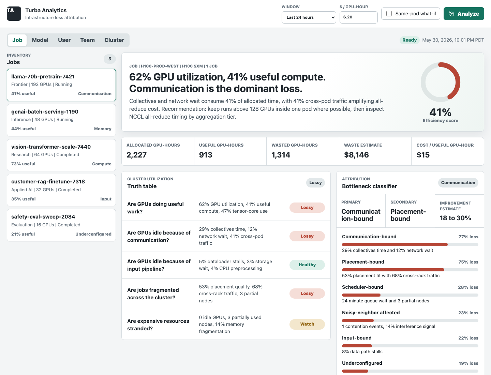

# Turba Analytics

Screenshot artifact from `build/`; regenerate locally after material layout changes.

Focused MVP for answering where AI infrastructure performance and money are being lost, and why.

Open `index.html` in a browser. The current build is a static prototype with synthetic job data and no backend dependency.

## What is implemented

- Job, model, user, team, and cluster inventory scopes
- Job efficiency score based on useful accelerator time divided by allocated accelerator time
- Cluster utilization truth table
- Bottleneck attribution with primary and secondary causes
- Topology placement map with cross-pod and cross-rack signals
- Cost per useful GPU-hour and waste estimate
- Workload fingerprinting
- Baseline and regression checks
- Customer outcome report copy action
- Same-pod placement what-if toggle
- Normalized `turba.ingestion.v1` sample ingestion envelope with entity references and grouped metric domains
- Prometheus, DCGM, and Kubernetes sample importers that map source-shaped exports into the shared ingestion sections
- Browser-local persistence for imported job runs, per-run baselines, and the last analysis timestamp
- Shared `analytics-core.js` calculation module with focused Node tests
- NCCL trace fixtures and parser that attribute collective time by operation and topology tier
- Topology tier metadata surfaced in the placement panel
- File and API JSON ingestion for external `turba.ingestion.v1` feeds, source metric bundles, and NCCL traces
- Persisted analysis snapshots with trend views for efficiency, waste, NCCL time, and cost
- Workspace export, restore, and sample reset controls for browser-local state

## Data contract

`app.js` keeps sample runs in `SAMPLE_INGESTION`, a versioned ingestion payload with shared model, user, team, and cluster entities. Prometheus, DCGM, Kubernetes, and NCCL trace sample exports are merged through source-specific importers before the dashboard normalizes each run into analysis records. The merged ingestion payload, per-run baselines, and persisted analysis snapshots are stored in `localStorage` under `turba.analytics.workspace.v2`, then reloaded on the next visit. The workspace can be exported as a `turba.workspace.v2` JSON file and restored through the same JSON import path. Each run groups metrics by source domain: allocation, utilization, communication, input pipeline, memory, scheduler, reliability, configuration, work, baseline, placement, and trace attribution.

External imports can be full `turba.ingestion.v1` feeds, `{ "ingestion": ... }` wrappers, source bundles with `sources.prometheus`, `sources.dcgm`, `sources.kubernetes`, and `ncclTraces`, or a `runs` array with compatible entities. `fixtures/external-source-bundle.json` is a local fetch/import example.

## Operator docs

- [Data contract](docs/data-contract.md)
- [Operator walkthrough](docs/operator-walkthrough.md)
- [Telemetry integration](docs/telemetry-integration.md)
- [Visual QA checklist](docs/visual-qa.md)
- [Deployment](docs/deployment.md)
- [Ingestion JSON Schema](schemas/turba-ingestion.v1.schema.json)
- [Workspace JSON Schema](schemas/turba-workspace.v2.schema.json)

## Deployment

CI runs on pushes and pull requests through `.github/workflows/ci.yml`. GitHub Pages deployment is available through `.github/workflows/pages.yml`; enable Pages with GitHub Actions as the source.

## Tests

Run `node tests/run-all.js` to execute the full syntax and fixture test suite.

Run `node tests/analytics-core.test.js` to validate core efficiency, bottleneck, what-if, fingerprint, regression, and trend calculations.
Run `node tests/nccl-trace-parser.test.js` to validate NCCL operation and topology-tier attribution.
Run `node tests/external-ingestion-fixture.test.js` to validate the external source bundle fixture.
Run `node tests/workspace-export-fixture.test.js` to validate exported workspace shape.
Run `node tests/schemas.test.js` to validate schema files and fixture alignment.
Run `node tests/import-validation-copy.test.js` to validate import validation messages and helpers.
Run `node tests/static-page-wiring.test.js` to validate static DOM IDs, script order, and dashboard control wiring.
Run `node tests/docs-and-workflows.test.js` to validate docs, screenshots, and GitHub workflow entry points.

## Current status

The original prototype backlog is implemented. Real production telemetry requires an operator-provided export from Prometheus, DCGM, Kubernetes, and NCCL traces. Browser visual QA should be completed locally with the checklist in `docs/visual-qa.md`.
