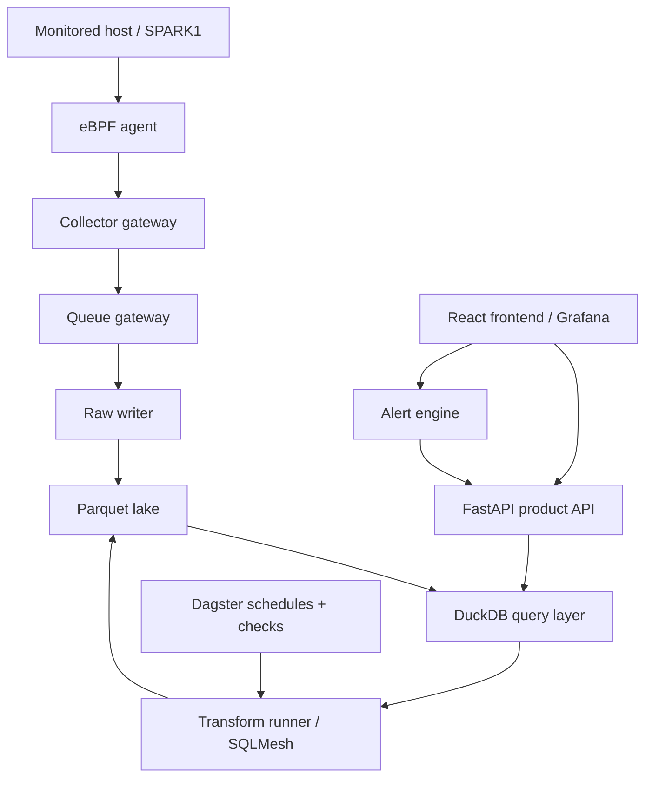

# turbalance Analytics


Screenshot artifacts live in `build/`, including `build/turbalance-analytics-desktop.png` and `build/turbalance-analytics-mobile.png`. Regenerate them after material layout changes and run the checklist in `docs/visual-qa.md` before sharing a demo build.

## Overview

turbalance Analytics is a static operator review surface for AI infrastructure. It answers a deceptively expensive question: where are accelerator performance and GPU-hour dollars being lost, and what should the operator do next?

The current product has a browser-first dashboard plus an optional controlled ingestion service. The dashboard loads a seeded workspace, accepts JSON exports from existing systems, normalizes them into a shared analysis model, and presents an operator workflow for diagnosing inefficient training or inference workloads. The backend service adds authenticated tenant-scoped ingest, signed upload URLs, audit logs, and retention controls for pilots that need a safer upload path. turbalance is especially shaped for neo-cloud GPU providers, AI platform teams, scheduler owners, capacity planners, support engineers, and customer-success teams that need to turn raw telemetry into explainable action.

Open `index.html` directly in a browser, or serve the repository with a local static server. All imported data is processed in the browser and persisted to `localStorage` under `turba.analytics.workspace.v2`.

## E2E Data Platform Architecture

The lakehouse-backed telemetry platform is now implemented as an end-to-end path: monitored hosts send eBPF and system telemetry through a collector gateway, Python workers write raw Parquet, DuckDB plus SQLMesh/dbt-style models build virtual sensor tables, Dagster schedules and checks the assets, and FastAPI/Grafana/React serve the product experience. The current dashboard and `turba.ingestion.v1` source-bundle contracts remain compatibility adapters while the durable Parquet/DuckDB path handles the live platform flow.



For SPARK1, the same platform runs as a single-host Kubernetes activation using a node-local Docker registry at `localhost:5000/turbalance`, local file-backed lake/queue defaults, pre-applied real Kubernetes Secrets, and a rendered single-host Kustomize overlay. That path is designed to prove the full data plane without waiting on external registry, AWS, or signing credentials. Provider production uses the same service boundaries but swaps in the approved external registry, cloud object storage, metadata database, secret store, and signed image release flow.

See `docs/e2e-data-platform.md` for the full data path, container map, raw table contracts, virtual sensor model list, checks, schedules, and phased implementation plan. See `docs/lakehouse-operations.md` for replay, certificate rotation, compaction, reconciliation, transform validation, Grafana, and alert runbooks.

For the bare-metal pilot appliance path, start with `docs/customer-productization.md`. It defines the single product config, runtime renderer, fleet rollout command, doctor check, and redacted support bundle flow that turn the current NUC/SPARK/Pi lab deployment into something we can operate for a friendly customer.

The executable platform slice includes:

- `proto/telemetry/v1/telemetry_batch.proto` and `schemas/turba-telemetry-batch.v1.schema.json` define the batch contract.
- `services/platform_common/platform_common/observability.py` adds OpenTelemetry-ready request metrics and trace-context propagation helpers shared by platform services.
- `scripts/generate-telemetry-protos.sh` generates Python gRPC stubs for the telemetry collector service.
- `services/raw-writer/raw_writer/writer.py`, `services/raw-writer/raw_writer/storage.py`, and `services/raw-writer/raw_writer/operations.py` write validated telemetry/source bundles into partitioned Parquet, support PyArrow object-store filesystems, compact raw partitions, and reconcile manifests.
- `services/collector-gateway/collector_gateway/app.py` accepts telemetry batches and source bundles over FastAPI.
- `services/collector-gateway/collector_gateway/security.py` and `services/collector-gateway/collector_gateway/identity.py` add HMAC signatures, nonce replay checks, mTLS/SPIFFE identity enforcement, rate limiting, and JSONL audit.
- `services/collector-gateway/collector_gateway/queue.py`, `services/collector-gateway/collector_gateway/backpressure.py`, `services/collector-gateway/collector_gateway/replay.py`, and `services/collector-gateway/collector_gateway/grpc_server.py` add authenticated external queue/spool backpressure, durable replay, and generated-protobuf gRPC serving.
- `services/queue-gateway/queue_gateway/app.py` provides the deployable HTTP queue-gateway adapter for collector overflow.
- `services/duckdb-query-service/duckdb_query_service/query.py` exposes typed lake queries with DuckDB support and a PyArrow fallback.
- `lakehouse/sqlmesh/`, including `lakehouse/sqlmesh/models/vs_principal_resource_mode.sql`, `lakehouse/sqlmesh/models/vs_gpu_starvation.sql`, and `lakehouse/sqlmesh/models/vs_alert_candidates.sql`, plus `lakehouse/dbt/models/vs_alert_candidates.sql` and `lakehouse/duckdb/views.sql` define the virtual sensor model path.
- `services/transform-runner/transform_runner/runner.py` materializes virtual sensor Parquet tables, and `services/transform-runner/transform_runner/validation.py` validates SQLMesh/dbt/DuckDB runtime readiness.
- `orchestration/dagster/turbalance_assets.py` defines Dagster assets, checks, and schedule wiring.
- `services/alert-engine/alert_engine/engine.py`, `services/alert-engine/alert_engine/store.py`, and `services/alert-engine/alert_engine/router.py` evaluate explainable resource alerts, persist alert lifecycle state, and route alerts to webhook, Slack, PagerDuty, or dry-run JSONL sinks.
- `services/api-server/api_server/app.py` and `services/api-server/api_server/auth.py` expose product API, API RBAC, tenant-scoped bearer tokens, JWKS/OIDC-style JWT verification, discovery catalog proxying, and SSE endpoints.
- `services/discovery-api/discovery_api/app.py`, `services/discovery-api/discovery_api/certificates.py`, `services/discovery-api/discovery_api/consul.py`, `services/discovery-api/discovery_api/store.py`, `agents/ebpf-agent/`, `agents/ebpf-agent/README.md`, `agents/ebpf-agent/probes/`, `agents/ebpf-agent/native/`, `frontend/react/src/App.tsx`, and `frontend/react/src/api.ts` provide the initial control-plane, optional Consul mirror, managed metadata store abstraction, local-CA/SPIRE/external-CA certificate modes, signed host-agent daemon, external eBPF summarizer hook, native libbpf/CO-RE eBPF source package, covariance/eigenvalue rolling sparklines, and API-backed React shell.
- `deploy/docker/lakehouse-compose.yml`, `deploy/docker/otel-collector-config.yaml`, `deploy/docker/otel-collector-config.production.yaml`, `deploy/docker/Dockerfile.ebpf-agent`, `deploy/docker/Dockerfile.platform-service`, `deploy/docker/Dockerfile.dagster`, `deploy/docker/Dockerfile.sqlmesh`, `ops/kubernetes/lakehouse-platform.yaml`, `ops/kubernetes/lakehouse-agent-daemonset.yaml`, `ops/kubernetes/lakehouse-queue-gateway.yaml`, `ops/kubernetes/lakehouse-platform-auth-secrets.yaml`, `ops/kubernetes/lakehouse-alert-routing.yaml`, `ops/kubernetes/lakehouse-consul-auth.yaml`, `ops/kubernetes/lakehouse-managed-storage.yaml`, `ops/kubernetes/lakehouse-otel-backend-secret.yaml`, `ops/kubernetes/lakehouse-otel-collector.yaml`, `ops/kubernetes/lakehouse-mtls.yaml`, `ops/kubernetes/mtls/kustomization.yaml`, `ops/kubernetes/lakehouse/base/kustomization.yaml`, `ops/kubernetes/lakehouse/production/kustomization.yaml`, `ops/kubernetes/lakehouse/managed-storage/kustomization.yaml`, `ops/kubernetes/lakehouse/otel-backend/kustomization.yaml`, `ops/kubernetes/lakehouse/spire/kustomization.yaml`, `ops/kubernetes/lakehouse/consul/kustomization.yaml`, and `ops/kubernetes/lakehouse-prometheus-rules.yaml` launch and monitor the agent and Python platform services locally or in Kubernetes.
- `ops/terraform/lakehouse/aws/` provisions the production S3 lake, RDS Postgres metadata DB, optional MSK broker, IAM policy, and Secrets Manager keys expected by the ExternalSecret manifests, including the optional Consul token binding.
- `scripts/build-lakehouse-platform-images.js` builds the lakehouse service images.
- `scripts/render-lakehouse-secrets.js` renders production Kubernetes secrets for collector auth, discovery enrollment, API RBAC, metadata DB, queue gateway, and mTLS client CA.
- `scripts/render-lakehouse-kustomize-overlay.js` renders release-specific Kustomize overlays with image registry/tag replacements and production config patches.
- `scripts/package-lakehouse-release.js` renders a strict release package, blocks placeholder production values, deletes development Secret resources from production Kustomize, and writes checksums plus secret requirements.
- `ops/lakehouse-production.env.example`, `ops/lakehouse-production.values.example.json`, `ops/lakehouse-ebpf-hosts.example.json`, `ops/lakehouse-slo-policy.example.json`, `scripts/bootstrap-lakehouse-production-material.js`, `scripts/generate-lakehouse-production-env.js`, `scripts/create-lakehouse-production-env-from-values.js`, `scripts/validate-lakehouse-secret-material.js`, `scripts/validate-lakehouse-production-config.js`, `scripts/sync-lakehouse-aws-secrets.js`, `scripts/validate-lakehouse-externalsecrets.js`, `scripts/validate-lakehouse-image-registry.js`, `scripts/generate-lakehouse-image-lock.js`, `scripts/sign-lakehouse-images.js`, `scripts/validate-lakehouse-live-observability.js`, `scripts/validate-lakehouse-terraform.js`, `scripts/run-lakehouse-terraform-rollout.js`, `scripts/validate-lakehouse-kubernetes-release.js`, `scripts/validate-lakehouse-secret-iam-consistency.js`, `scripts/validate-lakehouse-live-prerequisites.js`, `scripts/validate-lakehouse-release-supply-chain.js`, `scripts/package-lakehouse-native-ebpf.js`, `scripts/generate-lakehouse-change-window.js`, `scripts/create-lakehouse-production-activation-bundle.js`, `scripts/prepare-lakehouse-operator-workstation.js`, `scripts/prepare-lakehouse-target-host.js`, `scripts/prepare-lakehouse-local-registry.js`, `scripts/render-lakehouse-single-host-overlay.js`, `scripts/run-lakehouse-image-release.js`, `scripts/report-lakehouse-production-gaps.js`, `scripts/validate-lakehouse-slo-policy.js`, `scripts/validate-lakehouse-ebpf-probe-package.js`, `scripts/collect-lakehouse-ebpf-rollout-evidence.js`, `scripts/audit-lakehouse-production-readiness.js`, and `scripts/run-lakehouse-go-live.js` define, audit, and orchestrate the production rollout contract from one audited env or structured values file.
- `scripts/run-lakehouse-load-test.js` runs a collector source-bundle load smoke with bearer/HMAC support.
- `scripts/run-lakehouse-cluster-smoke.js`, `scripts/run-lakehouse-burn-in.js`, `scripts/run-ebpf-fleet-validation.js`, `scripts/validate-ebpf-agent-host.js`, `scripts/validate-lakehouse-security.js`, `scripts/validate-lakehouse-alerts-dashboards.js`, `scripts/prepare-screenshot-qa.js`, and `scripts/run-lakehouse-production-smoke.js` verify cluster rollout, live burn-in, eBPF fleet readiness, production material bootstrap, operator workstation readiness, target-host preparation planning, image release lane planning, production gap reporting, security hardening, Grafana/alert coverage, production env assembly, render paths, release packaging, image registry and image-lock plans, cosign signature plans, secret-material and secret-store plans, ExternalSecret readiness plans, Terraform static checks and rollout artifacts, Kubernetes release preflight, secret/IAM consistency, live prerequisites, release supply-chain/SBOM/signing plans, native eBPF release packaging, change-window rollback evidence, production activation bundle generation for `user@192.168.10.20`, SLO policy coverage, live endpoint plans, eBPF probe package readiness, eBPF rollout evidence, screenshot QA dependency preparation, and load-test dry-run parameters.
- `.github/workflows/lakehouse-platform.yml` validates the platform, builds optional pushed images, and uploads a strict lakehouse release package artifact.
- `deploy/docker/grafana/provisioning/datasources/turbalance-api.yml`, `deploy/docker/grafana/provisioning/dashboards/lakehouse.yml`, and `grafana/turbalance-lakehouse-virtual-sensors.json` provision Grafana panels backed by the product API virtual sensor endpoints.

The static dashboard can optionally read covariance and principal-mode virtual sensors from the platform API by adding `?platformApi=http://127.0.0.1:8080` to the URL. Without that parameter, it keeps using browser-local live telemetry calculations.

## DGX Spark Inference Stack

The two DGX Spark nodes can also be staged as a local inference service:

- DGX Spark 1: `user@192.168.10.20`, Ray head, OpenAI-compatible API endpoint, primary vLLM or NIM/TRT-LLM server, and Open WebUI.
- DGX Spark 2: `user@192.168.10.21`, Ray worker and distributed inference worker.
- Client apps: OpenAI SDK clients, Open WebUI, agents, and RAG apps pointed at `http://192.168.10.20:8355/v1`.

Use `deploy/dgx-spark-inference/` for the host scripts and `scripts/prepare-dgx-spark-inference.js` for SSH-based sync/start orchestration. The default ports are Ray `6379`, Ray dashboard `8265`, Ray client `10001`, model API `8355`, and Open WebUI `3001`; port `8000` stays reserved for this dashboard. The default setup starts an Ollama fallback proxy on `:8355`, so Open WebUI has the local Ollama models immediately while vLLM or NIM/TRT-LLM is being selected.

```sh
node scripts/prepare-dgx-spark-inference.js --all
```

The stack intentionally keeps NGC, Hugging Face, and OpenAI-compatible API keys in the host-local `dgx-spark.env` file, not in git. Fill `NIM_IMAGE`/`NGC_API_KEY` for the NVIDIA NIM/TRT-LLM path, or `VLLM_IMAGE`/`MODEL_ID`/`HF_TOKEN` for the vLLM path. See `deploy/dgx-spark-inference/README.md` and validate with:

```sh
ssh user@192.168.10.20 'cd /home/user/dgx-spark-inference && ./status.sh'
```

For the experimental dual-Spark 405B path, the repo follows NVIDIA's vLLM playbook defaults for `hugging-quants/Meta-Llama-3.1-405B-Instruct-AWQ-INT4` over the dedicated CX7 subnet `192.168.100.10/24` <-> `192.168.100.11/24`. Use `configure-cx7-link.sh`, `start-vllm-ray-head.sh`, `start-vllm-ray-worker.sh`, `download-vllm-405b-model.sh`, and `start-vllm-405b-openai.sh`. NCCL is carried by the containerized vLLM/Ray path with `NCCL_SOCKET_IFNAME=enp1s0f1np1`; validate it with `validate-vllm-nccl.sh` or `node scripts/prepare-dgx-spark-inference.js --validate-nccl`. The 405B settings are intentionally memory constrained and intended for testing, not production traffic.

Current SPARK1 status:

- Target host: `user@192.168.10.20`
- Namespace: `turbalance-lakehouse`
- Core deployments: `api-server`, `collector-gateway`, `dagster`, `discovery-api`, `duckdb-query-service`, `otel-collector`, and `queue-gateway`
- Host agent: `turbalance-ebpf-agent` DaemonSet
- Live cluster smoke artifact: `build/lakehouse-single-host-cluster-smoke.json`
- Target-host readiness artifact: `build/lakehouse-target-host-home-strict.json`
- Current production gap report: `build/lakehouse-production-gaps-material-live/production-gaps.md`

Verify the live SPARK1 single-host path:

```sh
PATH="$PWD/build/lakehouse-tools/bin:$PATH" \
kubectl -n turbalance-lakehouse get deploy,daemonset,pods

PATH="$PWD/build/lakehouse-tools/bin:$PATH" \
node scripts/run-lakehouse-cluster-smoke.js \
  --namespace turbalance-lakehouse \
  --timeout-seconds 180 \
  > build/lakehouse-single-host-cluster-smoke.json
```

Exercise the local lakehouse path:

```sh
PYTHONPATH=services/raw-writer:services/platform_common \
python3 -m raw_writer --input fixtures/external-source-bundle.json --lake-root build/lakehouse --source-bundle --tenant-id tenant-a --host-id source-host

PYTHONPATH=services/transform-runner:services/duckdb-query-service:services/platform_common \
python3 -m transform_runner --lake-root build/lakehouse --tenant-id tenant-a

PYTHONPATH=services/transform-runner:services/duckdb-query-service:services/raw-writer:services/platform_common \
python3 -m transform_runner --lake-root build/lakehouse --tenant-id tenant-a --validate

node tests/platform-lakehouse.test.js
```

## What It Does

turbalance connects infrastructure telemetry, scheduler evidence, provider commercial context, and operator recommendations into one review loop:

1. Select a job, model, user, team, cluster, tenant, account, or reservation.
2. Read useful compute, waste, cost, bottleneck, topology, and provider impact.
3. Compare scheduler/capacity scenarios before changing placement policy.
4. Open Grafana handoff links or source context when deeper telemetry validation is needed.
5. Rank opportunities by estimated impact, risk, and confidence.
6. Export a redacted evidence pack or workspace for support, QBR, renewal, and capacity-planning handoff.

The dashboard remains intentionally static. It does not require live cluster credentials, live billing credentials, or direct access to customer systems. Production telemetry is connected by exporting source-shaped JSON from existing observability, scheduler, billing, and support systems, then importing it directly in the browser or sending it through the optional backend ingestion service.

## Quick Start

Open the dashboard:

```sh
open index.html
```

For API fetches or relative fixture URLs, a local static server is often more reliable than `file://`:

```sh
python3 -m http.server 8000
```

Then open `http://127.0.0.1:8000/`.

Try the provider-focused sample:

1. Open the app.
2. Click `Import JSON`.
3. Select `fixtures/neo-cloud-provider-bundle.json`.
4. Switch between `Tenant`, `Account`, and `Reservation` scopes.
5. Review the Provider Lens, Scheduler Simulator, Grafana Handoff, Opportunity Engine, and evidence-pack export.

Run the full validation suite:

```sh
node tests/run-all.js
```

## GB100/GB200 Blackwell Telemetry Stack

The repo now includes a production-oriented telemetry package for NVIDIA GB100/GB200-class GPU nodes. It layers always-on DCGM Exporter metrics, optional app/workload instrumentation, optional NVML confidential-computing status, optional facility/coolant data, Prometheus recording rules, Grafana dashboards, alerts, validation, and a support-report CLI.

When a live-machine bundle detects a GB10 host such as SPARK1, it adds a GB10 monitoring list rather than pretending the host exposes the same fields as GB100/GB200 servers. The list is `GB10 NVML/gpustat/nvidia-smi`, `Linux UMA memory`, `App metrics`, and `Nsight/CUPTI optional profiling exporter`; those entries are shown only when GB10 is present.

Start the local Prometheus/Grafana/DCGM demo stack:

```sh
make run-local
```

Deploy the Kubernetes DaemonSet and collector:

```sh
make deploy-k8s
```

Validate the telemetry package and generate `build/gb100-support/support-report.json` plus `support-report.md`:

```sh
make validate-gpu
```

Build a portable package that can be copied to another machine:

```sh
make package-gb100
```

On a target host, unpack the tarball and run one of:

```sh
sudo ./install.sh --mode docker --prefix /opt/turbalance-analytics
sudo ./install.sh --mode k8s --prefix /opt/turbalance-analytics
./install.sh --mode static --prefix "$HOME/turbalance-analytics"
sudo ./install.sh --mode static --prefix /opt/turbalance-analytics --with-systemd --live-machine --live-machine-host-url http://192.168.10.20:8000
```

Key files:

- `install.sh`: portable installer for Docker Compose, Kubernetes, or static-only deployments.
- `docs/install.md`: package and target-machine install guide.
- `metrics/gb100-dcgm-fields.csv`: custom DCGM Exporter allowlist for health, utilization, power, thermal, memory, interconnect, fabric, and C2C fields.
- `prometheus/gb100-recording-rules.yml`: normalized metrics such as `gpu_power_watts`, `gpu_sm_active_ratio`, `gpu_tensor_pipe_active_ratio`, `gpu_nvlink_tx_bytes_per_second`, and `gpu_xid_error_code`.
- `alerts/gb100-alerts.yml`: XID, ECC, thermal, power, NVLink, C2C, fabric, PCIe, memory, and workload-efficiency alerts.
- `grafana/gb100-*.json`: ready-to-import dashboards for overview, compute, memory, interconnect, health/RAS, power/thermal, and tenant workloads.
- `collectors/app_telemetry_exporter.py`: app JSONL/HTTP POST exporter on `:9500` with safe workload labels.
- `bin/gb100-telemetry-report`: support report generator for actual host capability and scrape health.

The stack intentionally does not invent unsupported Blackwell-specific metrics. Per-format FP4/FP8/NVFP4 Tensor Core attribution, Transformer Engine internals, decompression-engine utilization, raw RAS-engine internals, coolant temperature, and confidential-computing performance guarantees are marked as profiler-required, app-instrumentation-required, external-system-required, unsupported, or benchmark-required with reasons. See `docs/metric-capability-matrix.md`, `docs/architecture.md`, `docs/unsupported-metrics.md`, and `docs/runbook.md`.

## Current Status

The original prototype backlog is implemented. The repo includes:

- A polished branded static GUI using the turbalance mark and wordmark from `assets/turbalance-mark.png` and `assets/turbalance-analytics-logo.png`
- Browser-local workspace persistence, reset, restore, normal export, redacted export, and evidence-pack export
- Normalized ingestion, source-bundle, and workspace schemas
- Importers for Prometheus, DCGM, Kubernetes, scheduler/admission systems, Grafana handoff links, Linux eBPF summaries, provider commercial overlays, upstream opportunities, and NCCL traces
- Neo-cloud provider workflows for tenant/account/reservation views, queue SLOs, sellable waste, commit burn, margin pressure, and portfolio risk
- Scheduler/capacity scenario simulation and an Opportunity Engine for ranked actions
- Tests, fixtures, exporter examples, GitHub Actions CI, Playwright visual QA workflow, and GitHub Pages packaging
- Optional backend ingestion service with bearer, HS256 JWT, and RS256/JWKS auth, tenant isolation, role-aware controls, signed uploads, token and upload-key rotation, audit export, Prometheus metrics, source-bundle validation, local file/object-SQLite modes, managed Postgres plus S3-compatible object storage mode, secret-file support, provider export jobs, source-system collectors, and retention cleanup

Real production use still requires operator-provided exports from the relevant systems. Automated screenshot QA runs when Playwright is available and skips cleanly otherwise; browser visual QA should still be completed locally before a customer-facing demo.

## Feature Map

### Diagnosis And Review

- Job, model, user, team, cluster, tenant, account, and reservation scopes
- Useful compute score based on useful accelerator time divided by allocated accelerator time
- Metric ribbon for allocated GPU-hours, useful GPU-hours, wasted GPU-hours, waste dollars, and cost per useful GPU-hour
- Truth table for useful work, communication wait, input pipeline stalls, placement fragmentation, and stranded resources
- Bottleneck attribution with primary and secondary causes
- Customer outcome report with copy action
- Same-pod placement what-if toggle
- Baseline and regression checks
- Workload fingerprinting
- Persisted trend snapshots for efficiency, waste, NCCL time, network utilization, cost, sellable waste, opportunity impact, commit burn, queue SLO, and gross margin

### Topology And Trace Evidence

- Placement map with rack, pod, active node, partial-node, cross-rack, and cross-pod signals
- NCCL trace parser and fixtures
- Collective attribution by operation and topology tier
- Trace-derived communication, cross-rack, and cross-pod signals

### Scheduler And Capacity

- Scheduler event importer for queue, admission, locality, preemption, backfill, and placement-retry evidence
- Scheduler/capacity simulator for repack, locality-group, and queue-SLO what-if scenarios
- Scenario ranking by projected GPU-hour recovery, dollar upside, queue minutes saved, useful compute, placement quality, and confidence
- Scheduler evidence redaction in workspaces and evidence packs

### Neo-Cloud Provider Operations

- Provider Lens for tenant, account, reservation, billing model, SLO, customer tier, sellable waste, commit burn, queue SLO, and gross margin
- Provider portfolio risk tables for sellable waste, queue SLO misses, margin pressure, and noisy-neighbor candidates
- First-class tenant, account, and reservation scopes
- Provider source overlays through `sources.provider` for commercial and support metadata without requiring live billing credentials
- Evidence-pack workflow for support escalations, QBRs, renewals, and capacity-planning reviews

### Opportunity Engine

- Locally computed ranked actions across Useful Compute FinOps, fabric/topology, scheduler/capacity, provider SLO risk, inference economics, data pipeline, host-kernel/eBPF, fleet reliability, energy/carbon, and evidence-pack categories
- Optional `sources.opportunities` overlay for upstream recommendation systems
- Impact estimates in dollars and GPU-hours
- Risk, confidence, owner, evidence, and recommendation fields
- Markdown evidence-pack export for the selected scope with summary, scheduler what-if, Grafana handoff rows, ranked recommendations, impact, and redacted source context

### Grafana Support

- `sources.grafana` overlay for dashboard and Explore handoff links tied to selected runs, tenants, accounts, or reservations
- Grafana Handoff GUI panel with dashboard, datasource, variables, time range, and links
- Redaction for Grafana base URLs, instance names, org IDs, dashboard UIDs, dashboard slugs, dashboard titles, folders, datasource UIDs, datasource names, variables, and full dashboard/Explore URLs
- Ready-to-import dashboard template at `grafana/turbalance-provider-overview.json`

### Live Telemetry And Observation Log

- Live System Resources card for network utilization. It shows NIC/link utilization percent when link speed is known, otherwise falls back to aggregate RX/TX throughput.
- Network source context fields for interface name, link speed, RX/TX bytes, RX/TX bytes per second, drops, and errors.
- Relationship Watch includes `Network/GPU` and `Network/CPU`; live mode uses actual CPU telemetry, while analysis snapshots use CPU prep as the host-side proxy.
- Network pressure alerts cover high or rising utilization while GPU utilization is flat or falling.
- Observation Log records interpreted events rather than every one-second sample. It keeps alerts, threshold crossings, material resource deltas, GPU counter loss, and material network throughput changes while suppressing steady-state noise.
- Observation Log controls include `Copy` for the visible interpreted entries and `Clear` to hide current entries until newer meaningful events arrive.

### Linux eBPF Support

- `sources.ebpf` host-summary importer for CPU scheduling, socket/network, storage, and noisy-neighbor evidence
- Mapping of eBPF summaries into existing lanes: network wait, network utilization, storage wait, CPU preprocessing pressure, contention, latency tail, and noise events
- Exporter example in `scripts/build-ebpf-overlay.js`
- Sample input in `fixtures/ebpf-export-inputs/host-samples.json`

## Data Model And Contracts

The primary normalized feed is `turba.ingestion.v1`. Each run can include:

- `refs`: model, user, team, cluster, tenant, account, and reservation keys
- `allocation`: duration, GPU count, allocated GPU-hours, and GPU model
- `utilization`: GPU utilization, useful compute, SM occupancy, and tensor-core use
- `communication`: NCCL time, network wait, network utilization, cross-rack traffic, cross-pod traffic, and all-to-all time
- `inputPipeline`: dataloader, storage, and CPU preprocessing stalls
- `memory`: HBM capacity, HBM bandwidth, fragmentation, and KV-cache pressure
- `scheduler`: placement quality, idle GPUs, partial nodes, queue wait, admission attempts, placement retries, and related capacity signals
- `reliability`: noise events, contention, step regularity, and latency tail
- `configuration`: precision loss and batch inefficiency
- `work`: tokens, steps, or inference requests
- `baseline`: comparison values for regression checks
- `placement`: allocated node list and partial node list
- `schedulerEvidence`: scheduler/admission source evidence
- `grafanaContext`: dashboard, datasource, variable, time-range, and link context
- `commercial`: provider billing and commitment metadata
- `slo`: queue, efficiency, priority, and support-ticket targets
- `opportunities`: optional upstream actions

Machine-readable schemas:

- `schemas/turba-ingestion.v1.schema.json`
- `schemas/turba-source-bundle.v1.schema.json`
- `schemas/turba-workspace.v2.schema.json`

The app accepts these import shapes:

- Full `turba.ingestion.v1` feeds
- `{ "ingestion": ... }` wrappers
- Source bundles with `sources.prometheus`, `sources.dcgm`, `sources.kubernetes`, `sources.scheduler`, `sources.grafana`, `sources.ebpf`, `sources.provider`, `sources.opportunities`, and `ncclTraces`
- A bare `runs` array with compatible entities
- Full `turba.workspace.v2` workspace exports

For live-machine and source-context telemetry, network utilization is intentionally separate from network wait. `networkWait` means latency, loss, or stall pressure; `networkUtilization` means NIC/link throughput pressure. Optional source context can include `networkInterface`, `networkLinkSpeedMbps`, `networkRxBytes`, `networkTxBytes`, `networkRxBytesPerSecond`, `networkTxBytesPerSecond`, `networkUtilizationPct`, `networkRxDrops`, `networkTxDrops`, `networkRxErrors`, and `networkTxErrors`.

See `docs/data-contract.md` for field-level examples and validation behavior.

## Source Overlays

Source overlays let teams keep existing observability and business systems in place while emitting small JSON bundles keyed by `runId`.

| Source | Purpose | Example |
| --- | --- | --- |
| `sources.prometheus` | Ratios and counters for utilization, useful compute, NCCL time, network wait, network utilization, input stalls, queue wait, tokens, steps, and requests | `fixtures/external-source-bundle.json` |
| `sources.dcgm` | NVIDIA/DCGM hardware counters for SM, tensor core, HBM, fragmentation, and KV-cache pressure | `docs/telemetry-integration.md` |
| `sources.kubernetes` | Pod/job state, namespace, selectors, allocation, scheduler state, and placement | `fixtures/provider-export-inputs/kubernetes-jobs.json` |
| `sources.scheduler` | Queue, admission, placement retry, locality miss, preemption, backfill, and requested GPU shape evidence | `fixtures/scheduler-export-inputs/scheduler-events.json` |
| `sources.grafana` | Dashboard and Explore links, datasource metadata, time range, and variables | `grafana/turbalance-provider-overview.json` |
| `sources.ebpf` | Host-side CPU scheduling, socket/network, storage, and noisy-neighbor summaries | `fixtures/ebpf-export-inputs/host-samples.json` |
| `sources.provider` | Tenant, account, reservation, billing, commitment, support, and SLO metadata | `fixtures/provider-overlay-template.json` |
| `sources.opportunities` | Imported recommendations from external tuners, simulators, support workflows, or capacity tools | `fixtures/external-source-bundle.json` |
| `ncclTraces` | Collective operation traces used for topology-tier attribution | `nccl-trace-fixtures.js` |

Exporter examples:

```sh
node scripts/build-provider-overlay.js fixtures/provider-export-inputs > provider-overlay.json
node scripts/build-scheduler-overlay.js fixtures/scheduler-export-inputs > scheduler-overlay.json
node scripts/build-ebpf-overlay.js fixtures/ebpf-export-inputs > ebpf-overlay.json
node scripts/build-provider-pilot-bundle.js fixtures/provider-pilot-export-inputs > provider-pilot-bundle.json
```

Validate source bundles before import or upload:

```sh
node scripts/validate-source-bundle.js --require-source-export provider-pilot-bundle.json
```

## Backend Ingestion

Provider pilots can run `server/ingestion-server.js` when uploads need controlled tenancy, signatures, role-aware access, audit logs, and retention policy.

```sh
TURBALANCE_TENANT_TOKENS="tenant-a:tenant-token:operator,admin:admin-token:admin" \
TURBALANCE_UPLOAD_SECRET="replace-with-random-secret" \
TURBALANCE_DATA_DIR=".turbalance-data" \
node server/ingestion-server.js
```

The service provides:

- `POST /v1/uploads/sign`: authenticated signed upload URL creation
- `PUT /v1/uploads/:uploadId`: short-lived signed upload path
- `POST /v1/ingestion`: authenticated direct ingest path
- `GET /v1/audit`: tenant-scoped audit rows
- `GET /v1/audit/export`: tenant-scoped audit export as JSON, JSONL, or CSV
- `GET /metrics`: Prometheus-style backend operational metrics
- `POST /v1/retention/run`: retention cleanup
- `GET /v1/tenants` and `POST /v1/tenants`: admin tenant registry controls
- `POST /v1/tokens/rotate`: admin tenant token rotation
- `POST /v1/upload-keys/rotate`: admin signed-upload key rotation

All accepted uploads are validated with `lib/source-bundle-validator.js`, JWT/JWKS verification lives in `server/ingestion-oidc.js`, secret-file loading lives in `server/ingestion-secrets.js`, uploads are stored through `server/ingestion-storage.js`, and audit rows are logged to the configured control plane. See `docs/backend-ingestion.md` for the full API.

## Privacy And Redaction

turbalance is designed for sensitive operator workflows. The browser prototype can export:

- A normal `turba.workspace.v2` workspace for internal restore and handoff
- A redacted workspace that preserves metrics while replacing identifiers with deterministic surrogates
- A Markdown evidence pack for human review

Redaction covers run IDs, model/user/team/cluster/tenant/account/reservation refs, commercial contract IDs, support tickets, Kubernetes namespaces and pod selectors, Slurm job IDs, scheduler queues and admission classes, provider export IDs, billing accounts, reservation windows, eBPF hosts/nodes/pods/containers/cgroups, Grafana dashboard/link identifiers, and imported opportunity free text.

Numeric evidence, trend snapshots, cost estimates, scheduler what-if rows, and high-level recommendations are preserved so support and capacity teams can reason about the issue without leaking raw customer identifiers.

## Repository Layout

- `index.html`: static dashboard shell
- `styles.css`: responsive visual system and panel layouts
- `app.js`: browser app, ingestion, rendering, persistence, redaction, and export logic
- `analytics-core.js`: shared scoring, bottleneck, provider economics, scheduler simulation, and opportunity calculations
- `nccl-trace-parser.js`: NCCL trace parser
- `nccl-trace-fixtures.js`: local trace fixtures
- `assets/`: turbalance logo assets
- `build/`: screenshot artifacts
- `docs/`: operator, telemetry, provider, deployment, visual QA, and demo documentation
- `fixtures/`: sample source bundles, workspace exports, provider overlays, scheduler events, eBPF inputs, and exporter inputs
- `grafana/`: Grafana dashboard templates, including `grafana/turbalance-provider-overview.json`
- `lib/`: shared validation helpers used by CLI tooling and the ingestion backend
- `ops/`: Kubernetes and Prometheus operation templates, including `ops/kubernetes/ingestion-deployment.yaml`, `ops/kubernetes/ingestion-retention-cronjob.yaml`, `ops/kubernetes/provider-export-cronjob.yaml`, `ops/kubernetes/ingestion-service-monitor.yaml`, `ops/kubernetes/ingestion-prometheus-rules.yaml`, and SPARK1 demo manifests such as `ops/kubernetes/spark1-kafka.yaml`
- `schemas/`: JSON Schemas for ingestion, source bundles, and workspaces
- `scripts/`: dependency-free exporter examples
- `server/`: optional controlled ingestion service and swappable file storage adapter
- `tests/`: syntax, fixture, schema, exporter, redaction, static wiring, and docs tests
- `.github/workflows/ci.yml`: CI verification
- `.github/workflows/pages.yml`: GitHub Pages static deployment

## Key Fixtures

- `fixtures/external-source-bundle.json`: canonical external source-bundle example
- `fixtures/neo-cloud-provider-bundle.json`: provider-focused demo bundle with tenants, reservations, SLOs, Prometheus metrics, scheduler evidence, Grafana links, eBPF evidence, and imported opportunities
- `fixtures/provider-overlay-template.json`: minimal provider overlay template
- `fixtures/provider-pilot-export-inputs/`: per-system pilot export inputs for the all-lanes bundle builder
- `fixtures/prometheus-collector-queries.json`: starter Prometheus/DCGM query map for live source export collection
- `ops/pilot-provider.config.example.json`: managed deployment render config for a pilot provider
- `ops/source-contracts.example.json`: source-owner endpoint/query contract template for pre-schedule validation
- `ops/source-approvals.example.json`: source-owner approval manifest template for scheduled collector enablement
- `fixtures/workspace-export.json`: canonical workspace export shape
- `fixtures/provider-export-inputs/kubernetes-jobs.json`: provider exporter Kubernetes sample input
- `fixtures/scheduler-export-inputs/scheduler-events.json`: scheduler exporter sample input
- `fixtures/ebpf-export-inputs/host-samples.json`: eBPF exporter sample input

## Operator Documentation

- [Data contract](docs/data-contract.md)
- [Backend ingestion](docs/backend-ingestion.md)
- [Operator walkthrough](docs/operator-walkthrough.md)
- [Neo-cloud provider fit](docs/neo-cloud-provider-fit.md)
- [Provider export template](docs/provider-export-template.md)
- [Neo-cloud pilot validation](docs/neo-cloud-pilot-validation.md)
- [Telemetry integration](docs/telemetry-integration.md)
- [Operations](docs/operations.md)
- [Visual QA checklist](docs/visual-qa.md)
- [Deployment](docs/deployment.md)
- [Demo logistics](docs/demo-logistics.md)
- [Demo script](docs/demo-script.md)
- [Demo release checklist](docs/demo-release-checklist.md)
- [Ingestion JSON Schema](schemas/turba-ingestion.v1.schema.json)
- [Source bundle JSON Schema](schemas/turba-source-bundle.v1.schema.json)
- [Workspace JSON Schema](schemas/turba-workspace.v2.schema.json)

## Testing

Run everything:

```sh
node tests/run-all.js
```

Focused test entry points:

- `tests/analytics-core.test.js`: core efficiency, bottleneck, what-if, fingerprint, regression, trend, provider economics, scheduler simulation, and opportunity calculations
- `tests/provider-image.test.js`: provider ingestion Dockerfile and build/publish dry-run
- `tests/provider-config-generator.test.js`: provider pilot config generator and strict readiness handoff
- `tests/prepare-demo.test.js`: demo artifact generator, source validation, readiness report, and hardware/scheduler notes
- `tests/local-machine-bundle.test.js`: host telemetry bundle collector for live workstation demos
- `tests/provider-readiness.test.js`: provider config/source-contract readiness gate
- `tests/provider-go-live-gates.test.js`: end-to-end dry-run go-live orchestration and evidence artifacts
- `tests/lakehouse-go-live.test.js`: lakehouse production env validation, structured values env assembly, secret-material audit, release packaging, image digest lock and cosign signature planning, image release lane planning, operator workstation planning, target-host preparation planning, production gap reporting, native eBPF package generation, change-window evidence, production activation bundle generation for `user@192.168.10.20`, Terraform rollout dry-run, live prerequisite planning, release supply-chain validation, Kubernetes release preflight, secret/IAM consistency, SLO policy validation, go-live dry-run, burn-in plan, and eBPF fleet plan
- `tests/lakehouse-production-readiness.test.js`: lakehouse production env assembly, structured values env assembly, production material bootstrap, secret-material audit, image registry, image digest lock and cosign signature planning, image release lane planning, operator workstation planning, production gap reporting, live observability, AWS secret-store sync, ExternalSecret readiness, Terraform static validation and rollout artifacts, live prerequisite planning, release supply-chain validation, native eBPF package generation, change-window evidence, secret/IAM consistency, SLO policy validation, eBPF probe package validation, eBPF rollout evidence, and production readiness audit gates
- `tests/sandbox-go-live.test.js`: strict sandbox source gateway and go-live runner dry-run checks
- `tests/nccl-trace-parser.test.js`: NCCL operation and topology-tier attribution
- `tests/external-ingestion-fixture.test.js`: canonical external source-bundle fixture
- `tests/neo-cloud-provider-fixture.test.js`: provider overlays, SLO fields, provider economics, scheduler simulation, and opportunity generation
- `tests/provider-exporter.test.js`: provider exporter example
- `tests/scheduler-exporter.test.js`: scheduler exporter example
- `tests/ebpf-exporter.test.js`: eBPF host overlay exporter example
- `tests/prometheus-source-exporter.test.js`: Prometheus/DCGM HTTP collector with mocked Prometheus API responses
- `tests/spark1-kafka.test.js`: SPARK1 Kafka broker manifest and smoke-check guardrails
- `tests/source-system-collectors.test.js`: Kubernetes, scheduler/admission, Grafana, billing/SLO, eBPF, NCCL, and opportunity collector staging
- `tests/source-contracts.test.js`: source-owner contract validator across approved endpoints and Prometheus queries
- `tests/source-approvals.test.js`: source-owner approval manifest validation and expiry checks
- `tests/provider-pilot-bundler.test.js`: all-lanes provider pilot bundle builder
- `tests/provider-pilot-export-job.test.js`: provider pilot export job wrapper for bundle generation and optional ingestion upload
- `tests/ingestion-oidc.test.js`: RS256/JWKS JWT validation, tenant mapping, and role mapping
- `tests/ingestion-secrets.test.js`: secret-file loading for tenant tokens, upload keys, and JWT secrets
- `tests/ingestion-storage.test.js`: file storage adapter uploads, audit rows, control JSON, and deletes
- `tests/managed-storage.test.js`: managed Postgres plus S3-compatible object storage adapter command contract
- `tests/ingestion-server.test.js`: signed upload, direct ingest, role-aware auth, JWKS auth, tenant provisioning, key rotation, metrics, audit export, and retention service behavior
- `tests/provision-tenant.test.js`: admin tenant bootstrap CLI and token issuance
- `tests/provision-customer-iam.test.js`: tenant bootstrap plus secret-manager binding plan
- `tests/render-managed-kubernetes.test.js`: managed Kubernetes manifest rendering without PVC-backed local state
- `tests/live-pilot-burn-in.test.js`: staged bundle validation and optional ingestion upload loop
- `tests/retention-job.test.js`: standalone retention job behavior
- `tests/source-bundle-validator.test.js`: source-bundle validation library and CLI
- `tests/workspace-export-fixture.test.js`: exported workspace shape
- `tests/evidence-pack-export.test.js`: Markdown evidence-pack redaction
- `tests/schemas.test.js`: schema files and fixture alignment
- `tests/source-bundle-validation.test.js`: source bundle preflight checks
- `tests/import-validation-copy.test.js`: import validation messages and helpers
- `tests/static-page-wiring.test.js`: static DOM IDs, script order, and dashboard control wiring
- `tests/docs-and-workflows.test.js`: docs, screenshots, schemas, scripts, Grafana template, and GitHub workflow entry points
- `scripts/build-publish-ingestion-image.js`: provider ingestion image build/publish gate using `ops/pilot-provider.config.example.json`
- `scripts/generate-provider-pilot-config.js`: generates a non-placeholder provider pilot config from approved registry, IAM, secret-store, object-store, and tenant values
- `scripts/collect-local-machine-bundle.js`: samples the current Linux/macOS/BSD host, NVIDIA GPU through optional `gpustat --json` with selective `nvidia-smi` fallback when present, Docker, Grafana, Kafka, Netdata, Ollama, node-exporter, procfs, disk, memory, and network state into a source bundle; network fields include interface counters, link speed where available, byte-rate deltas, drops/errors, and utilization percent only when link speed is known; when Ollama has an already-loaded model in `/api/ps`, it records a tiny generation probe for tokens per second and time to first token
- `scripts/collect-machine-fleet-bundle.js`: combines strict live observations from the demo host plus approved SSH machines such as `user@192.168.10.20` and `user@192.168.10.21` into one live machine bundle without synthesizing provider/source overlays; unreachable remotes are recorded as explicit SSH reachability observations instead of dropping the whole bundle
- `scripts/push-live-machine-telemetry.js`: runs on SPARK, Pi, or NUC hosts, collects strict local live-machine telemetry, signs requests when HMAC is configured, persists sequence numbers, times out stuck collector posts, spools offline source bundles, replays them, and pushes to the collector gateway as `/v1/source-bundles`
- `scripts/rollout-production-fleet.js`: dry-run/apply rollout planner for `user@192.168.10.20`, `user@192.168.10.21`, and `pi@pi1` through `pi@pi12`; it syncs the repo, writes the live-agent env, installs systemd units, and can enable periodic benchmarks and the OTel exporter stack
- `scripts/run-live-lakehouse-fleet.js`: runs on NUC14E, keeps the combined SPARK1/SPARK2 `build/demo/live-machine-bundle.json` fresh for the static dashboard, and can also write/materialize the Parquet lakehouse path
- `services/system-id-worker/system_id_worker`: Python worker that applies spike/step/ramp/sinusoidal identification probes, monitors CPU/GPU/RAM/network through the live-machine collector, writes a comparison-ready fingerprint report, emits `system_identification` telemetry batches, and optionally writes them to the Parquet lakehouse
- `scripts/run-system-characterization.js`: SSH automation runner for SPARK1/SPARK2 system characterization; it runs the worker, posts telemetry batches to the NUC14E collector, and materializes the lakehouse virtual sensor tables
- `scripts/check-spark1-kafka.js`: applies the SPARK1 single-node Kafka broker, waits for readiness, and runs a produce/consume smoke Job
- `scripts/prepare-demo.js`: generates demo overlays, provider pilot bundle, readiness reports, managed manifests, and hardware/scheduler demo notes under `build/demo/`
- `scripts/validate-provider-readiness.js`: validates pilot config, IAM/secret-store shape, storage targets, and source-contract coverage
- `scripts/run-provider-go-live-gates.js`: orchestrates readiness, image, manifests, optional source contracts, burn-in, and evidence reports
- `scripts/run-lakehouse-go-live.js`: orchestrates lakehouse production env assembly, structured values env assembly, secret-material audit, config validation, live prerequisite checks, Terraform static/apply gates with captured plan artifacts, AWS Secrets Manager sync, image build/push plus registry verification, digest lock evidence, and cosign signing/verification hooks, release packaging, release supply-chain/SBOM/signing plans, native eBPF package generation, change-window rollback evidence, secret/IAM consistency checks, Kubernetes release preflight, Kubernetes deploy/smoke, ExternalSecret readiness, burn-in, live observability checks, SLO policy validation, eBPF probe package validation, eBPF fleet validation, and rollout evidence collection
- `scripts/bootstrap-lakehouse-production-material.js`: creates ignored operator-owned env/values material with generated tokens, JWKS, agent CA PEM, and strict secret-material validation
- `scripts/prepare-lakehouse-operator-workstation.js`: plans or installs local CLI prerequisites and reports Docker daemon, registry login, AWS credential, and kubeconfig actions
- `scripts/prepare-lakehouse-target-host.js`: plans or performs SSH reachability, remote directory creation, repository sync, and strict prebuilt eBPF host validation for `user@192.168.10.20`
- `scripts/prepare-lakehouse-local-registry.js`: starts a single-node Docker registry, mirrors already-built lakehouse images into `localhost:5000/turbalance`, and reports the k3s image prefix for SPARK1-style clusters without external registry credentials
- `scripts/render-lakehouse-single-host-overlay.js`: renders the SPARK1 single-host Kustomize overlay with local-registry images, file-backed lake/queue defaults, and placeholder Secret deletion so pre-applied real Secrets are preserved
- `scripts/run-lakehouse-image-release.js`: runs the image release lane from build/push through registry validation, digest lock generation, and cosign sign/verify planning
- `scripts/report-lakehouse-production-gaps.js`: writes a concise JSON/Markdown report of the remaining production materials, including secret material, target-host prep, image release, signing, and screenshot QA prerequisites
- `scripts/run-sandbox-go-live.js`: starts a disposable local registry, mock source gateway, ingestion container, and strict zero-warning sandbox go-live gate
- `scripts/run-sandbox-source-gateway.js`: serves provider pilot fixtures as approved-source mock HTTP APIs for local and SSH sandbox validation
- `scripts/fetch-source-system-export.js`: source-system collector for Kubernetes, scheduler/admission, Grafana, billing/SLO, eBPF, NCCL, and opportunity exports
- `scripts/fetch-prometheus-source-export.js`: live Prometheus/DCGM collector that emits source bundles or staged provider input files
- `scripts/provision-customer-iam.js`: customer onboarding helper that provisions a tenant token and secret-manager binding plan
- `scripts/render-managed-kubernetes.js`: renders provider-specific managed Kubernetes manifests from `ops/pilot-provider.config.example.json`
- `scripts/validate-source-contracts.js`: validates source-owner endpoint contracts before scheduled collectors are enabled
- `scripts/validate-source-approvals.js`: validates source-owner approval manifests against source-contract URLs, query files, and approval expiry
- `scripts/run-live-pilot-burn-in.js`: runs a staged or live-contract burn-in loop and optionally posts to ingestion
- `scripts/provision-tenant.js`: admin helper for pilot tenant creation and ingest-token rotation
- `scripts/run-provider-pilot-export-job.js`: provider pilot export job for mounted source exports and optional ingestion upload
- `scripts/run-retention-job.js`: standalone retention job for cron or Kubernetes CronJob wiring
- `scripts/run-screenshot-qa.js`: desktop and mobile screenshot QA when Playwright is installed; skips by default when browser automation is unavailable

Pilot configs:

- `ops/pilot-provider.config.example.json` and `ops/source-contracts.example.json` are replacement templates for a real provider account.
- `ops/source-approvals.example.json` is the source-owner signoff template that must match the provider source-contract URLs and query files.
- `scripts/generate-provider-pilot-config.js` turns approved provider values into the pilot config consumed by `scripts/render-managed-kubernetes.js`, `scripts/build-publish-ingestion-image.js`, and `scripts/run-provider-go-live-gates.js`.
- `ops/pilot-provider.sandbox.json`, `ops/source-contracts.sandbox.json`, and `ops/source-approvals.sandbox.json` are strict local/SSH sandbox configs. They target a disposable local registry on `127.0.0.1:5000` and a mock source gateway on `127.0.0.1:8891`, so readiness gates can run without placeholder warnings.

Use `git diff --check` before committing to catch whitespace issues.

Demo prep:

```sh
node scripts/prepare-demo.js --out-dir build/demo
```

This writes `build/demo/demo-readiness.md`, generated source overlays, `build/demo/provider-pilot-bundle.json`, `build/demo/live-machine-bundle.json`, strict sandbox readiness output, rendered managed Kubernetes manifests, and the provider image dry-run report. Add `--require-screenshots` when Playwright is available and the visual artifacts must be verified for a customer-facing demo.

When the demo is served from a known live-machine host, the app automatically fetches `build/demo/live-machine-bundle.json` and refreshes it every 1 second while the tab is visible. Today that includes `192.168.10.30` for the NUC14E/SPARK1 lab view, `192.168.10.20` for a standalone `SPARK1` view, `192.168.10.21` for the additional SSH-monitored host, `pi1` through `pi12` for the Raspberry Pi fleet, and `100.96.89.98` for the standalone `DGX-pat` view.

Production bare-metal mode is documented in `docs/bare-metal-fleet-production.md`. It replaces the live telemetry data plane with node-local systemd agents that push into the NUC collector, keeps SSH as rollout/debug tooling, and adds optional node_exporter/cAdvisor/DCGM/OpenTelemetry sidecars for standard host/container/GPU observability.

NUC14E lakehouse mode uses `user@192.168.10.30` as the central data-lake host. Its `/dev/nvme1n1p2` partition is already mounted as `/`, so the local lake root is `/home/user/turbalance-lakehouse` on that device. The static dashboard stays on `:8000`, the product API serves lakehouse virtual sensors on `:8080`, and the collector gateway accepts SPARK source bundles on `:8801`. When the dashboard is opened from `192.168.10.30`, it automatically checks `http://192.168.10.30:8080` for covariance and principal-resource-mode virtual sensors while still reading the live fleet bundle from `build/demo/live-machine-bundle.json`.

Central NUC14E commands:

```sh
cd /home/user/turbalance-analytics
mkdir -p /home/user/turbalance-lakehouse build/demo
python3 -m venv --system-site-packages .venv-lakehouse
.venv-lakehouse/bin/python -m pip install duckdb

sudo ufw allow from 192.168.10.0/24 to any port 8080 proto tcp
sudo ufw allow from 192.168.10.0/24 to any port 8801 proto tcp

(cd /home/user && nohup env PYTHONPATH=/home/user/turbalance-analytics/services/api-server:/home/user/turbalance-analytics/services/duckdb-query-service:/home/user/turbalance-analytics/services/raw-writer:/home/user/turbalance-analytics/services/platform_common:/home/user/turbalance-analytics/services/alert-engine \
  TURBALANCE_LAKE_ROOT=/home/user/turbalance-lakehouse \
  /home/user/turbalance-analytics/.venv-lakehouse/bin/python -m uvicorn api_server.app:app --host 0.0.0.0 --port 8080 \
  > /home/user/turbalance-analytics/build/lakehouse-api.log 2>&1 &)

(cd /home/user && nohup env PYTHONPATH=/home/user/turbalance-analytics/services/collector-gateway:/home/user/turbalance-analytics/services/raw-writer:/home/user/turbalance-analytics/services/platform_common \
  TURBALANCE_LAKE_ROOT=/home/user/turbalance-lakehouse \
  TURBALANCE_COLLECTOR_REPLAY_DB=/home/user/turbalance-analytics/build/collector/replay.sqlite \
  TURBALANCE_COLLECTOR_AUDIT_LOG=/home/user/turbalance-analytics/build/collector/audit.jsonl \
  TURBALANCE_COLLECTOR_SPOOL_DIR=/home/user/turbalance-analytics/build/collector/spool \
  /home/user/turbalance-analytics/.venv-lakehouse/bin/python -m uvicorn collector_gateway.app:app --host 0.0.0.0 --port 8801 \
  > /home/user/turbalance-analytics/build/collector-gateway.log 2>&1 &)

nohup node scripts/run-live-lakehouse-fleet.js \
  --out build/demo/live-machine-bundle.json \
  --lake-root /home/user/turbalance-lakehouse \
  --host-url http://192.168.10.30:8000 \
  --remote-root /home/user/Analytics \
  --include-local \
  --remote user@192.168.10.20 \
  --remote user@192.168.10.21 \
  --skip-lakehouse \
  --loop-ms 1000 \
  > build/live-lakehouse-fleet.log 2>&1 &

# Raspberry Pi fleet mode: collects pi@pi1 through pi@pi12, keeps
# cached periodic benchmark suites fresh, and feeds the Fleet Comparison
# dashboard card with Pi benchmark histograms.
nohup node scripts/run-live-lakehouse-fleet.js \
  --out build/demo/live-machine-bundle.json \
  --lake-root /home/user/turbalance-lakehouse \
  --host-url http://192.168.10.30:8000 \
  --include-local \
  --pi-fleet \
  --pi-benchmarks \
  --skip-lakehouse \
  --loop-ms 1000 \
  > build/live-pi-fleet.log 2>&1 &

# Fast SPARK-only PTP clock feed for the SPARK Pair Compare rolling graph.
nohup node scripts/run-spark-clock-feed.js \
  --out build/demo/spark-clock-offset.json \
  --remote user@192.168.10.20 \
  --remote user@192.168.10.21 \
  --loop-ms 1000 \
  > build/spark-clock-feed.log 2>&1 &

nohup node scripts/push-live-machine-telemetry.js \
  --collector-url http://127.0.0.1:8801/v1/source-bundles \
  --tenant-id dgx-lab \
  --host-url http://192.168.10.30:8000 \
  --loop-ms 1000 \
  > build/demo/live-machine-push.log 2>&1 &
```

SPARK push commands:

```sh
cd /home/user/Analytics
nohup node scripts/push-live-machine-telemetry.js \
  --collector-url http://192.168.10.30:8801/v1/source-bundles \
  --tenant-id dgx-lab \
  --host-url http://192.168.10.30:8000 \
  --loop-ms 1000 \
  > build/demo/live-machine-push.log 2>&1 &
```

The live resources panel surfaces CPU, RAM, network utilization, GPU utilization, GPU power, GPU memory, Docker, disk, Ollama generation telemetry, CPU temperature when exposed by the host, and signal freshness from the strict machine bundle. Network utilization appears as NIC/link percent when link speed is known, and falls back to RX/TX throughput when capacity is unavailable. On the DGX Spark pair, the collector prefers the machine-to-machine interconnect (`enp1s0f1np1`, `192.168.100.10 <-> 192.168.100.11`) before the management LAN, so the dashboard network tile reflects traffic between the two DGX hosts. One-shot fleet collectors persist the last NIC counter in `build/demo/live-network-rate-cache.json`, which keeps RX/TX rate and utilization calculations live across SSH sample processes. The same live samples drive in-browser telemetry graphs for roughly the latest five minutes of sample history.

The Live Operator Cockpit includes a Fleet Comparison card for multi-host groups such as `pi@pi1` through `pi@pi12`. It ranks hosts by live health, capacity, network posture, and system-identification signature distance; it also reports metric spread with coefficient-of-variation and robust median/MAD outlier counts so differences between otherwise similar Pi nodes stand out quickly.

The SPARK1/SPARK2 comparison is clock-aware. Each live-machine sample carries `timedatectl` synchronization state, systemd-timesyncd offset/jitter, chrony offsets when `chronyc` is installed, and linuxptp state when `ptp4l`/`phc2sys` are present. The dashboard shows clock discipline, host sample timestamp skew, and a rolling clock-offset graph for SPARK1, SPARK2, their delta, and sample skew. On the NUC14E dashboard, `scripts/run-spark-clock-feed.js` also keeps `build/demo/spark-clock-offset.json` fresh as a lightweight SPARK-only PTP feed, so the clock graph and clock rows update every second even when the full NUC/SPARK/Pi fleet bundle takes longer to refresh. This makes PTP over the dedicated DGX interconnect useful without fabricating precision: when linuxptp is not running, the comparison still reports the current NTP/timesync source and marks the pair as synchronized but not PTP-disciplined.

When host `sudo` is not available, the SPARK nodes can still run linuxptp through Docker on the hardware-timestamped CX7 interface:

```sh
# SPARK1
deploy/dgx-spark-inference/configure-ptp.sh master

# SPARK2
deploy/dgx-spark-inference/configure-ptp.sh slave
```

The script builds `turbalance/linuxptp:24.04`, starts the `turbalance-linuxptp` container with host networking and `/dev/ptp*` access, runs `ptp4l` and `phc2sys`, and leaves the collector able to query `pmc` from inside the container.

Relationship Watch computes short-window trend slopes and cross-metric relationships. It includes `Network/GPU` and `Network/CPU` alongside CPU/GPU, Power/GPU, and RAM/CPU, and it raises relationship alerts for conditions such as CPU rising while GPU is flat, high or rising network utilization while GPU is flat/falling, memory/disk pressure drift, thermal drift, lagging GPU counters, and power/utilization divergence. The idle-accelerator alert is gated on host-side work so an idle machine does not create a false bottleneck.

System identification:

The system-ID worker measures a machine as a dynamic system. For each selected target (`cpu`, `gpu`, `ram`, `network`, `disk`) it runs baseline, workload, and recovery stages using spike/impulse, step, ramp, and sinusoidal input profiles while all live-machine telemetry remains monitored. The worker extracts gain, response delay, rise time, settling time, peak delta, recovery area, overshoot, and cross-correlation for CPU, GPU, GPU memory, RAM, network, disk, GPU power, and GPU temperature outputs. Those features become a stable fingerprint that can be compared across SPARK1, SPARK2, the NUC, the Raspberry Pi fleet, or future hosts.

Use simulation mode first to validate the pipeline without stressing hardware:

```sh
PYTHONPATH=services/system-id-worker:services/platform_common:services/raw-writer \
python3 -m system_id_worker run \
  --simulate \
  --targets cpu,gpu,ram,network,disk \
  --profiles impulse,step,ramp,sine \
  --out build/system-identification/sim-report.json \
  --batch-out build/system-identification/sim-batch.json \
  --lake-root build/system-identification/lake \
  --tenant-id dgx-lab \
  --host-id sim-host
```

Run a conservative live CPU probe on a host:

```sh
PYTHONPATH=services/system-id-worker:services/platform_common:services/raw-writer \
python3 -m system_id_worker run \
  --quick \
  --targets cpu \
  --profiles impulse,step,ramp \
  --intensity-pct 35 \
  --max-cpu-percent 35 \
  --out build/system-identification/cpu-report.json \
  --batch-out build/system-identification/cpu-batch.json \
  --lake-root /home/user/turbalance-lakehouse \
  --tenant-id dgx-lab \
  --host-id "$(hostname)"
```

GPU, RAM, network, and disk loads are opt-in. GPU load uses `--enable-gpu-load --gpu-command '<command with {seconds} and {intensity}>'`, so operators can choose DCGM diagnostics, a CUDA spin binary, or a model-serving canary. RAM load uses bounded Python allocation with `--enable-ram-load --ram-max-mb <mib>`. Network load uses `iperf3` only when `--enable-network-load --network-peer <host>` is supplied. Disk load uses `--enable-disk-load --disk-command '<command with {seconds} and {intensity}>'` so operators can provide an environment-appropriate fio/dd wrapper. Compare two reports with:

```sh
PYTHONPATH=services/system-id-worker \
python3 -m system_id_worker compare \
  --baseline build/system-identification/spark1-report.json \
  --candidate build/system-identification/spark2-report.json \
  --out build/system-identification/spark1-vs-spark2.json
```

Lakehouse writes land in `raw_system_identification`; `transform_runner` materializes `vs_system_identification_signature`; the product API exposes `/v1/virtual-sensors/system-identification`.

Automate SPARK1/SPARK2 characterization from NUC14E with the conservative multi-subsystem profile:

```sh
cd /home/user/turbalance-analytics
node scripts/run-system-characterization.js --nuc local
```

Run it continuously every 30 minutes:

```sh
cd /home/user/turbalance-analytics
nohup node scripts/run-system-characterization.js \
  --nuc local \
  --loop-minutes 30 \
  --out build/system-identification/automation-run.json \
  > build/system-identification/automation.log 2>&1 &
```

The default automation targets `user@192.168.10.20:SPARK1` and `user@192.168.10.21:SPARK2`, characterizes CPU/GPU/RAM/network/disk targets with active CPU load and passive observation for opt-in load classes, writes batches to `http://192.168.10.30:8801/v1/telemetry/batches`, and refreshes `/home/user/turbalance-lakehouse`. The Live Operator Cockpit reads `/v1/virtual-sensors/system-identification` and renders the latest host fingerprints as subsystem cards, profile bars, and rolling feature sparklines.

Automate the 12-node Raspberry Pi fleet with the same conservative profile:

```sh
cd /home/user/turbalance-analytics
nohup node scripts/run-system-characterization.js \
  --nuc local \
  --pi-fleet \
  --targets cpu,ram,network,disk \
  --profiles impulse,step,ramp \
  --loop-minutes 30 \
  --out build/system-identification/pi-automation-run.json \
  > build/system-identification/pi-automation.log 2>&1 &
```

`--pi-fleet` expands to `pi@pi1:PI1` through `pi@pi12:PI12` and uses `/home/pi/Analytics` as the remote checkout path for those hosts. Use `--include-spark-hosts` when the same run should include SPARK1/SPARK2 as well.

The Observation Log records interpreted events rather than raw one-second sample noise. It keeps active alerts, threshold crossings, material resource deltas, GPU counter loss, and material network throughput changes; steady CPU/RAM/Disk/GPU/Network samples are suppressed. The log has `Copy` and `Clear` controls: copy exports the visible interpreted entries as plain text, and clear hides current entries until a newer meaningful event arrives.

On GB10 hosts it also shows the GB10 monitor count and Linux UMA memory from `/proc/meminfo`, with monitor rows for NVML/gpustat/nvidia-smi, app metrics on `:9500`, and optional Nsight/CUPTI profiling hooks. High-rate collectors can run as resident loops and label very recent cached GPU samples when GPU telemetry is slower than the browser cadence. Use `TURBALANCE_GPU_BACKEND=auto|gpustat|nvidia-smi` to prefer `gpustat --json`, force it, or force the selective `nvidia-smi` query. When Ollama is reachable and `/api/ps` reports a loaded model, the collector sends a tiny streaming prompt to the loaded model and caches the resulting tokens-per-second and time-to-first-token reading for 30 seconds; use `--ollama-probe 0` to disable that probe or `--ollama-probe-ms <milliseconds>` to change the cache interval. If no model is loaded, the dashboard reports Ollama as reachable without fabricating throughput. The live-machine bundle is strict: it only claims observed gpustat/NVML, `nvidia-smi`, host OS counters, Docker, Ollama, and reachable local services, and it does not synthesize Kubernetes, DCGM, eBPF, scheduler, provider, or billing overlays. Use `?demo=sample` to keep the seeded sample feed, or `?demo=machine` to force the live-machine bundle on another host.

SPARK1 after reboot:

If `systemctl restart turbalance-analytics.service turbalance-gb100-app-collector.service` reports `Unit ... not found`, the static installer has not created systemd units on SPARK1 yet. Start the standalone SPARK1 demo from the checkout:

```sh
cd /home/user/Analytics
mkdir -p build/demo

nohup node scripts/collect-local-machine-bundle.js \
  --out build/demo/live-machine-bundle.json \
  --host-url http://192.168.10.20:8000 \
  --dgx-interconnect-interface enp1s0f1np1 \
  --dgx-interconnect-subnet-prefix 192.168.100. \
  --loop-ms 1000 \
  --fast-refresh 1 \
  > build/demo/live-machine-collector.log 2>&1 &

nohup python3 -m http.server 8000 --bind 0.0.0.0 \
  > build/demo/static-server.log 2>&1 &
```

Then open `http://192.168.10.20:8000/`. Confirm the app and live bundle are available with:

```sh
curl -I http://127.0.0.1:8000/
curl -fsS http://127.0.0.1:8000/app.js | grep -E 'Network/GPU|liveSignificantSampleObservations'
ls -lh build/demo/live-machine-bundle.json
tail -50 build/demo/live-machine-collector.log
```

To install restartable static services for future boots, run:

```sh
cd /home/user/Analytics
pwd
ls -la install.sh scripts/collect-local-machine-bundle.js

sudo ./install.sh \
  --mode static \
  --prefix /opt/turbalance-analytics \
  --with-systemd \
  --live-machine \
  --live-machine-host-url http://192.168.10.20:8000
```

If `sudo ./install.sh` prints `sudo: ./install.sh: command not found`, the shell is not in a checkout that contains the installer, or the SPARK1 copy is older than this reboot-safe installer change. Find the real checkout or refresh the copy before installing:

```sh
find /home/user -maxdepth 4 -name install.sh -print
git -C /home/user/Analytics status
```

If `install.sh` exists but is not executable, run the installer through `sh`:

```sh
sudo sh ./install.sh \
  --mode static \
  --prefix /opt/turbalance-analytics \
  --with-systemd \
  --live-machine \
  --live-machine-host-url http://192.168.10.20:8000
```

If `install.sh` is missing but `scripts/collect-local-machine-bundle.js` exists, create the reboot-safe services manually from the current checkout:

```sh
cd /home/user/Analytics
test -f index.html
test -f scripts/collect-local-machine-bundle.js
NODE_BIN="$(command -v node)"
PYTHON_BIN="$(command -v python3)"
test -n "$NODE_BIN"
test -n "$PYTHON_BIN"
mkdir -p build/demo

sudo tee /etc/systemd/system/turbalance-analytics.service >/dev/null <<EOF
[Unit]
Description=turbalance Analytics static app
After=network-online.target
Wants=network-online.target

[Service]
User=user
Group=user
WorkingDirectory=/home/user/Analytics
ExecStart=$PYTHON_BIN -m http.server 8000 --bind 0.0.0.0
Restart=always
RestartSec=3

[Install]
WantedBy=multi-user.target
EOF

sudo tee /etc/systemd/system/turbalance-live-machine-collector.service >/dev/null <<EOF
[Unit]
Description=turbalance live machine bundle collector
After=network-online.target turbalance-analytics.service
Wants=network-online.target

[Service]
User=user
Group=user
WorkingDirectory=/home/user/Analytics
ExecStart=$NODE_BIN scripts/collect-local-machine-bundle.js --out build/demo/live-machine-bundle.json --host-url http://192.168.10.20:8000 --loop-ms 1000 --fast-refresh 1
Restart=always
RestartSec=3

[Install]
WantedBy=multi-user.target
EOF

sudo systemctl daemon-reload
sudo systemctl enable --now turbalance-analytics.service turbalance-live-machine-collector.service
```

If `/opt/turbalance-analytics` already exists from an earlier install, add `--force` after confirming the checkout contains the version you want to run. That creates and starts `turbalance-analytics.service`, `turbalance-gb100-app-collector.service`, and `turbalance-live-machine-collector.service`. The live-machine service is the piece that keeps `build/demo/live-machine-bundle.json` fresh after reboot.

After installation or reboot, verify all three static-mode services and the live bundle:

```sh
sudo systemctl status \
  turbalance-analytics.service \
  turbalance-gb100-app-collector.service \
  turbalance-live-machine-collector.service

curl -fsS http://127.0.0.1:8000/ >/dev/null
curl -fsS http://127.0.0.1:8000/build/demo/live-machine-bundle.json | head -c 300
journalctl -u turbalance-live-machine-collector.service -n 80 --no-pager
```

For the SPARK1 Kubernetes, Prometheus, DCGM, and Grafana path after reboot, first confirm that the node and NVIDIA GPU resource are visible:

```sh
nvidia-smi
kubectl get nodes
kubectl get nodes -o custom-columns=NAME:.metadata.name,GPUS:.status.allocatable.nvidia\\.com/gpu
```

Then restart the local observability stack and keep the local forwards open. Prometheus is used by the collector on SPARK1; Grafana is exposed for the dashboard handoff link:

```sh
kubectl apply -f ops/kubernetes/spark1-observability.yaml
kubectl -n turbalance-observability rollout status daemonset/dcgm-exporter
kubectl -n turbalance-observability rollout status deployment/prometheus
kubectl -n turbalance-observability rollout status deployment/grafana

nohup kubectl -n turbalance-observability port-forward svc/prometheus 9090:9090 \
  --address 127.0.0.1 > build/demo/prometheus-port-forward.log 2>&1 &

nohup kubectl -n turbalance-observability port-forward svc/grafana 3000:3000 \
  --address 0.0.0.0 > build/demo/grafana-port-forward.log 2>&1 &
```

Run or refresh the labeled Kubernetes GPU workload, then collect a fresh SPARK1 source bundle with Kubernetes, scheduler, Prometheus, DCGM, and Grafana context:

```sh
kubectl apply -f ops/kubernetes/spark1-gpu-demo-job.yaml
kubectl -n turbalance-demo get pods -l turba.ai/run-id=spark1-k8s-demo-001 -w

node scripts/collect-spark1-kubernetes-demo.js \
  --run-id spark1-k8s-demo-001 \
  --namespace turbalance-demo \
  --prometheus-url http://127.0.0.1:9090 \
  --grafana-url http://192.168.10.20:3000/d/spark1-dcgm/spark1-dcgm-gpu-demo \
  --out build/demo/spark1-k8s-bundle.json
```

Quick checks:

```sh
kubectl -n turbalance-observability get pods,svc
curl -fsS http://127.0.0.1:9090/-/ready
curl -I http://127.0.0.1:3000/
curl -fsS 'http://127.0.0.1:9090/api/v1/query?query=DCGM_FI_DEV_GPU_UTIL' | head -c 500
```

Import `build/demo/spark1-k8s-bundle.json` in the analyzer when you want the Kubernetes/DCGM/Grafana evidence path. If the bundle only has `kubernetes` and `scheduler`, Prometheus or DCGM was not reachable at collection time; check the rollout and port-forward logs before claiming live GPU counter evidence.

## Deployment

The app can be hosted by any static file server that serves the root files plus `assets/`, `build/`, `fixtures/`, `docs/`, `schemas/`, `scripts/`, `grafana/`, `lib/`, and `server/`.

GitHub Actions:

- `.github/workflows/ci.yml` runs `node tests/run-all.js`, validates source bundles, and runs screenshot QA when browser automation is available.
- `.github/workflows/pages.yml` runs the full suite, validates source bundles, runs screenshot QA when available, assembles the static site, includes Grafana templates plus backend tooling, and deploys with GitHub Pages.
- `.github/workflows/sandbox-go-live.yml` runs the Docker-backed strict sandbox go-live gate and uploads the generated readiness, manifest, burn-in, and sandbox reports.

Enable GitHub Pages with GitHub Actions as the source before relying on the Pages deployment URL.

## Production Readiness Boundary

This repo is ready as a static pilot/demo surface, an integration contract for exported telemetry, a controlled-ingestion reference implementation for early pilots, and a SPARK1 single-host lakehouse activation. It is not yet a managed multi-tenant SaaS.

Current boundaries:

- Optional backend service with file mode, object/SQLite reference mode, and a managed Postgres plus S3-compatible object storage mode; the managed mode is the intended pilot deployment shape
- Bearer-token, HS256 JWT, RS256/JWKS, OIDC discovery, tenant mapping, tenant/customer bootstrap CLIs, and secret-manager binding plans; production IAM approval and break-glass policy still belong to the provider
- Provider exporter jobs can collect approved Prometheus/DCGM snapshots and approved Kubernetes, scheduler/admission, Grafana, billing/SLO, eBPF summary, NCCL trace, and opportunity exports through read-only source APIs
- Dedicated Visual QA workflow installs Playwright in CI; local screenshot QA still skips when Playwright is unavailable
- Directional estimates for waste, opportunity value, and scheduler recovery; validate against source systems before changing production policy or making customer commitments
- SPARK1 single-host lakehouse mode is operational with local registry images, local lake/queue storage, deployed platform services, live eBPF agent, and cluster smoke checks; this mode intentionally avoids external registry, AWS, and signing dependencies

Current SPARK1 lakehouse status:

- `user@192.168.10.20` is reachable and synced at `/home/user/Analytics`
- `turbalance-lakehouse` has all core deployments ready plus one ready `turbalance-ebpf-agent` DaemonSet
- `scripts/run-lakehouse-cluster-smoke.js` probes health endpoints from `deploy/api-server` so service checks obey the namespace NetworkPolicy model
- `scripts/prepare-lakehouse-local-registry.js` and `scripts/render-lakehouse-single-host-overlay.js` are the supported single-node activation lane
- `scripts/report-lakehouse-production-gaps.js` writes the current JSON/Markdown blocker report under `build/lakehouse-production-gaps-material-live/`

Remaining provider-specific production steps:

- Generate a provider pilot config with `scripts/generate-provider-pilot-config.js` using the provider-approved registry, secret store, IAM role, managed database secret names, object bucket, and tenant values
- Build and publish the provider-approved ingestion container image referenced by the provider pilot config
- Configure approved container registry credentials with `scripts/configure-lakehouse-registry-auth.js` before pushing external production images
- Configure AWS credentials before running `scripts/sync-lakehouse-aws-secrets.js` or `scripts/run-lakehouse-terraform-rollout.js --apply`
- Run `scripts/run-lakehouse-image-release.js --build --push` against the approved registry, then prove pushed manifests with `scripts/validate-lakehouse-image-registry.js`
- Generate a digest lock with `scripts/generate-lakehouse-image-lock.js`, then sign and verify image refs with `scripts/sign-lakehouse-images.js`
- Generate and audit the production env with `scripts/generate-lakehouse-production-env.js` or compile structured values with `scripts/create-lakehouse-production-env-from-values.js`; validate secret material with `scripts/validate-lakehouse-secret-material.js --strict`
- Package the lakehouse release with `scripts/package-lakehouse-release.js`, run `scripts/validate-lakehouse-release-supply-chain.js`, `scripts/validate-lakehouse-kubernetes-release.js`, and `scripts/audit-lakehouse-production-readiness.js`, then deploy only inside the approved change window
- Validate collector queries and endpoint contracts with each source-system owner before enabling scheduled jobs
- Run a live pilot burn-in against provider staging data before customer-facing use
