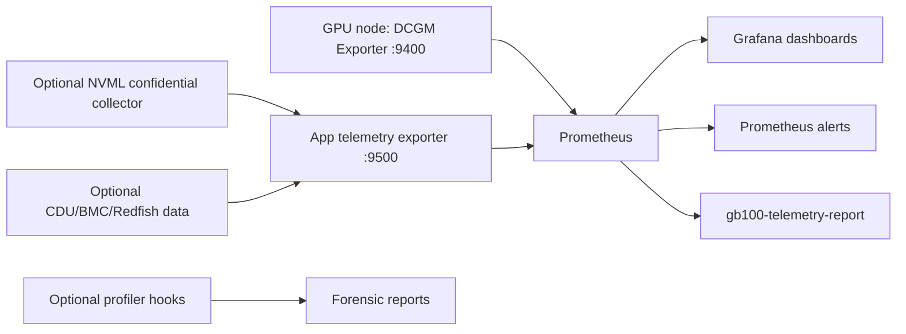

# GB100/GB200 Blackwell Telemetry Architecture

This package adds a real-time GPU telemetry stack for NVIDIA GB100/GB200-class nodes. It is designed around one rule: do not fake unsupported metrics. If a metric is not available from DCGM or NVML on the target host, it is reported as unavailable, profiler-required, application-instrumentation-required, external-system-required, or currently unsupported.

## Layers

### 1. Always-On DCGM Telemetry

DCGM Exporter runs on each GPU node and listens on `:9400`. It uses `metrics/gb100-dcgm-fields.csv` as the custom allowlist and scrapes at `1000` ms by default.

The always-on layer covers:

- Identity and inventory: name, UUID, PCI bus ID, driver, CUDA driver.
- Utilization: GPU util, memory-copy util, SM active, SM occupancy, Tensor pipe activity, DRAM active.
- Power and thermal: power draw, power limits, violation counters, GPU and memory temperatures.
- Memory: framebuffer total/free/used/reserved/used-percent and BAR1.
- RAS-visible health: ECC, retired pages, remapped rows, row-remap failure, XID.
- Interconnect: PCIe, NVLink, NVSwitch/fabric, and C2C counters where supported.

DCGM Exporter can run with embedded `nv-hostengine`, or it can connect to an existing remote hostengine using `DCGM_REMOTE_HOSTENGINE_INFO` / `-r`.

Aggressive polling can add host and driver overhead. Keep `1000` ms for demos and validation, then tune per production SLO.

### 2. App And Workload Instrumentation

`collectors/app_telemetry_exporter.py` listens on `:9500`. It accepts JSONL preload data or HTTP POST payloads at:

- `POST /metrics/app`
- `POST /metrics/facility`
- `GET /metrics`
- `GET /healthz`

Application telemetry is required for semantic workload fields that DCGM cannot know:

- `workload_id`
- `tenant_id`
- `model_name`
- `framework`
- `precision_mode`
- `transformer_engine_enabled`
- throughput, batch, sequence, KV-cache, nvCOMP, and NCCL app-level metrics

The collector exports only safe labels by default. It blocks high-cardinality or identity-like labels such as `request_id`, `user_id`, `session_id`, and `trace_id`.

Optional facility data can be posted as direct JSON or lightly Redfish-shaped JSON. These metrics are marked `external_system_required` because GPU APIs do not report CDU or coolant state.

### 3. Profiler And Forensic Instrumentation

Scripts in `collectors/profiling/` provide optional hooks for Nsight Compute, Nsight Systems, and CUPTI sampling. They are not part of the always-on monitoring path.

Use profiler hooks for questions that DCGM cannot answer directly:

- FP4 vs FP8 vs NVFP4 instruction/activity attribution.
- Per-kernel occupancy.
- Per-kernel memory throughput.
- Per-kernel Tensor Core usage.

Profiler data can require replay, sampling, elevated permissions, and workload slowdown. Treat it as forensic evidence, not low-overhead live telemetry.

## Data Flow



## Kubernetes Workload Attribution

The Kubernetes DaemonSet enables `DCGM_EXPORTER_KUBERNETES=true` so DCGM Exporter can attach pod/container mapping labels where supported. Prometheus also relabels Kubernetes service discovery metadata into:

- `namespace`
- `pod`
- `container`
- `node`

MIG labels are preserved when exported by DCGM or Kubernetes device-plugin metadata. Common labels include `mig_instance`, `GPU_I_PROFILE`, or driver/plugin-specific variants.

Known attribution limits:

- MPS can merge multiple client processes behind one server process.
- Multi-process serving can make one GPU metric represent several tenants or models.
- Multi-tenant inference servers should emit application metrics with tenant/workload labels.
- Slurm jobs need a sidecar or batch epilog that maps job IDs to allocated GPU UUIDs.
- Triton, vLLM, TensorRT-LLM, and PyTorch should emit app metrics to `POST /metrics/app` for model, precision, tokens/sec, batch, KV-cache, and NCCL signals.

## Startup Paths

Local demo:

```sh
make run-local
```

Kubernetes:

```sh
make deploy-k8s
```

Validation and support report:

```sh
make validate-gpu
```

Grafana opens at `http://127.0.0.1:3000` for the Docker path. Prometheus opens at `http://127.0.0.1:9090`.
