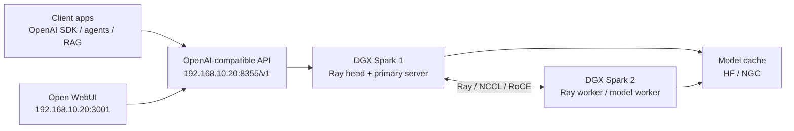

# DGX Spark Inference Stack

This directory stages a two-node inference path for:

- DGX Spark 1: `user@192.168.10.20`, Ray head, OpenAI-compatible API endpoint, primary model server.
- DGX Spark 2: `user@192.168.10.21`, Ray worker, distributed inference worker.
- Client apps: Open WebUI, OpenAI SDK clients, agents, and RAG apps pointed at `http://192.168.10.20:8355/v1`.

The scripts keep the model backend pluggable. Use `start-nim-primary.sh` plus `start-nim-worker.sh` for NVIDIA NIM/TRT-LLM style distributed serving, or `start-vllm-openai.sh` for a vLLM OpenAI-compatible server that uses the Ray cluster.



## Ports

- `6379`: Ray head.
- `8265`: Ray dashboard.
- `10001`: Ray client server.
- `8355`: OpenAI-compatible model API.
- `3001`: Open WebUI.

Port `8000` is intentionally avoided because SPARK1 already uses it for the turbalance dashboard.

## First-Time Setup

Copy the deployment directory to both hosts, then create a host-local env file:

```sh
cp dgx-spark.env.example dgx-spark.env
```

Install Ray on both nodes:

```sh
./install-ray.sh
```

Start the Ray head on DGX Spark 1:

```sh
./start-ray-head.sh
```

Start the Ray worker on DGX Spark 2:

```sh
./start-ray-worker.sh
```

Start Open WebUI on DGX Spark 1:

```sh
./start-ollama-openai-proxy.sh
./start-open-webui.sh
```

This immediately exposes the existing Ollama models through `http://192.168.10.20:8355/v1` so Open WebUI has models while you choose a vLLM or NIM/TRT-LLM backend. Stop the proxy before launching another server on port `8355`.

Then optionally select a model-serving backend.

## vLLM Backend

Multi-node vLLM requires the same vLLM/Ray runtime on every worker. The preferred path here is to run Ray inside the same vLLM image on both nodes.

Set these in `dgx-spark.env` on both hosts:

```sh
VLLM_IMAGE=<arm64-gb10-compatible-vllm-image>
MODEL_ID=<huggingface-model-id-or-local-path>
OPENAI_API_KEY=<client-key>
HF_TOKEN=<token-if-required>
```

If the host Ray cluster is running, stop it first on both hosts:

```sh
./stop.sh
```

Start the vLLM Ray head on DGX Spark 1:

```sh
./start-vllm-ray-head.sh
```

Start the vLLM Ray worker on DGX Spark 2:

```sh
./start-vllm-ray-worker.sh
```

Launch the OpenAI-compatible vLLM server from DGX Spark 1:

```sh
./start-vllm-openai.sh
```

## Experimental Llama 3.1 405B

The DGX Spark vLLM playbook documents `hugging-quants/Meta-Llama-3.1-405B-Instruct-AWQ-INT4` as a testing-only 405B path with insufficient memory headroom for production. The scripts here use the same constrained parameters:

- tensor parallel size: `2`
- max model length: `64`
- GPU memory utilization: `0.88` on these Spark hosts, leaving a small runtime reserve while keeping the tiny test context.
- max sequences: `1`
- max batched tokens: `64`

Configure the dedicated CX7 link once after boot:

```sh
sudo ./configure-cx7-link.sh head    # DGX Spark 1
sudo ./configure-cx7-link.sh worker  # DGX Spark 2
```

Stop the host Ray cluster and the Ollama proxy before starting vLLM on port `8355`:

```sh
./stop.sh
```

Start the containerized vLLM Ray head on DGX Spark 1 and worker on DGX Spark 2:

```sh
./start-vllm-ray-head.sh
./start-vllm-ray-worker.sh
```

Download the 405B AWQ model on each node if it is not already cached:

```sh
./download-vllm-405b-model.sh
```

Launch the OpenAI-compatible server from DGX Spark 1:

```sh
./start-vllm-405b-openai.sh
./status-vllm-405b.sh
```

Validate that both vLLM containers expose NCCL, Ray sees both GB10 GPUs, and the NCCL-backed distributed model path can answer a short OpenAI-compatible request:

```sh
./validate-vllm-nccl.sh
```

## NIM/TRT-LLM Backend

Set these in `dgx-spark.env` on both nodes:

```sh
NIM_IMAGE=<ngc-nim-image>
NGC_API_KEY=<ngc-api-key>
OPENAI_API_KEY=<client-key>
```

Start the primary on DGX Spark 1:

```sh
./start-nim-primary.sh
```

Watch the primary logs for `NIM_PRIMARY_NODE` and `NIM_NODE_MANAGER_PORT`, set those values in `dgx-spark.env` on DGX Spark 2, then start the worker:

```sh
./start-nim-worker.sh
```

## Validation

```sh
./status.sh
curl -H "Authorization: Bearer ${OPENAI_API_KEY}" \
  http://192.168.10.20:8355/v1/models
```

Open WebUI should be available at `http://192.168.10.20:3001`.

## Stop

```sh
./stop.sh
```
