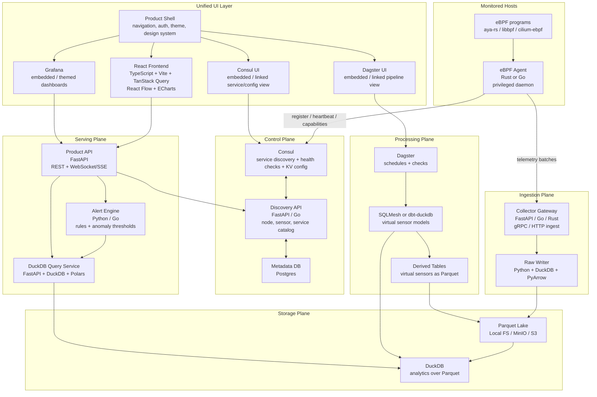

# E2E Data Platform Architecture

This document defines the target end-to-end telemetry path for moving turbalance from a browser-first analytics prototype plus optional ingestion service into a production data platform:

```text
Host -> eBPF agent -> collector gateway -> raw writer -> Parquet lake / DuckDB
  -> transform runner -> virtual sensor store -> API server
  -> React frontend / Grafana / alerts
```

The current dashboard, source-bundle schemas, GB100 telemetry assets, and ingestion service remain useful. They become compatibility adapters around the new lakehouse path instead of being replaced all at once.

## Target Flow



## Architectural Decisions

- Keep raw telemetry append-only. Raw tables are the forensic truth and should be immutable except for retention, compaction, and quarantine.
- Prefer Parquet as durable storage and DuckDB as the local/embedded analytical engine. DuckDB can query Parquet files directly, while PyArrow gives Python workers a stable columnar writer.
- Use SQLMesh as the default transform system for this repo because its planning, state, environments, audits, and DuckDB connection model fit iterative virtual-sensor development. Keep dbt-duckdb as a compatible option for teams already standardized on dbt.
- Use Dagster to orchestrate assets, schedules, freshness checks, schema checks, and backfills. It should call SQLMesh/dbt and worker jobs; it should not hide business logic inside opaque orchestration code.
- Keep FastAPI for Python-facing APIs and workers. Use WebSockets only for bidirectional interactive flows; use SSE for dashboard live updates where the browser only needs a server-to-client stream.
- Treat Grafana as a first-class consumer of the product API and derived tables, not as the only source of truth.
- Keep the existing `turba.ingestion.v1` and source-bundle contracts as migration adapters so current demos and fixtures continue to work.

## Container Map

| Container | Stack | Responsibility | First production contract |
| --- | --- | --- | --- |
| `ebpf-agent` | Rust, aya-rs, eBPF | Load eBPF programs, summarize host/kernel/network evidence, register host capabilities, batch telemetry. | Signed `TelemetryBatch` protobuf with host, sensor, monotonic sequence, event timestamps, and schema version. |
| `collector-gateway` | Python FastAPI first; Go/Rust optional later; gRPC/HTTP; Protobuf | Authenticate agents, validate batches, enforce tenant/cardinality limits, expose ingest health, apply backpressure. | `POST /v1/telemetry/batches` and gRPC equivalent. |
| `discovery-api` | Python FastAPI, Postgres, SQLAlchemy | Node catalog, sensor catalog, service catalog, desired config, enrollment state. | `hosts`, `agents`, `sensors`, `services`, and `capabilities` metadata tables. |
| `raw-writer` | Python, DuckDB, PyArrow, Parquet | Convert validated batches into partitioned Parquet files, maintain batch manifests, quarantine invalid payloads. | Atomic Parquet batch write plus manifest row. |
| `duckdb-query-service` | Python, FastAPI, DuckDB, Polars | Read raw and derived Parquet through DuckDB views, return bounded analytical result sets. | Tenant-scoped SQL templates and typed query endpoints. |
| `transform-runner` | Python, SQLMesh, DuckDB | Build virtual sensor models from raw Parquet and derived tables. | SQLMesh project with raw external models and derived virtual sensor models. |
| `dagster` | Python, Dagster | Schedule raw compaction, transformations, checks, freshness monitoring, and backfills. | Assets for raw tables, derived tables, and API readiness. |
| `alert-engine` | Python, DuckDB, Polars | Evaluate rule and anomaly thresholds against derived virtual sensors. | Alert candidate table plus API/SSE event stream. |
| `api-server` | Python, FastAPI, WebSockets, SSE | Product API, live updates, auth boundary, frontend/Grafana/Dagster integration. | REST for snapshots, SSE for live sensor updates, WebSocket for interactive session workflows. |
| `frontend` | React, TypeScript, Vite | Product shell, analytics UI, React Flow topology, ECharts trends/covariance/eigen visuals. | Typed API client with TanStack Query and streaming updates. |

## Raw Table Contracts

Every raw table should include these columns:

- `tenant_id`
- `host_id`
- `agent_id`
- `sensor_type`
- `source`
- `schema_version`
- `batch_id`
- `sequence_no`
- `event_ts`
- `ingest_ts`
- `trace_id`
- `payload_hash`

Initial raw tables:

| Table | Grain | Examples |
| --- | --- | --- |
| `raw_host_heartbeat` | One row per host heartbeat | CPU count, kernel release, agent version, uptime, capability flags. |
| `raw_ebpf_cpu_sched` | Time bucket per host/container | Run queue latency, off-CPU time, throttling, softirq share. |
| `raw_ebpf_net_socket` | Time bucket per host/interface/container | Socket latency, retransmits, drops, RX/TX bytes, link utilization. |
| `raw_gpu_sample` | Time bucket per host/GPU | GPU utilization, memory utilization, power, temperature, XID, DCGM/NVML fields. |
| `raw_memory_sample` | Time bucket per host/container | RAM usage, available bytes, pressure, NUMA/UMA evidence where available. |
| `raw_process_sample` | Time bucket per host/process/cgroup | CPU, memory, IO, workload labels after allowlist filtering. |
| `raw_collector_audit` | One row per control/ingest event | Auth result, validation result, batch size, quarantine reason. |

## Parquet Layout

Use Hive-style partitions so DuckDB, PyArrow, and object storage can prune by tenant and time:

```text
lake/
  raw/
    raw_ebpf_net_socket/
      tenant_id=tenant-a/dt=2026-06-04/hour=09/part-<batch-id>.parquet
  derived/
    vs_principal_resource_mode/
      tenant_id=tenant-a/dt=2026-06-04/hour=09/part-<run-id>.parquet
  manifests/
    raw_writer_batches/
      dt=2026-06-04/part-<writer-id>.parquet
  quarantine/
    invalid_batches/
```

Best-practice rules:

- Write to a temporary path first, then atomically rename or object-copy into the final path.
- Target files large enough to avoid tiny-file overhead. Start with 64-256 MiB target files, then compact by table/tenant/hour.
- Partition by `tenant_id`, `dt`, and `hour` first. Add `host_id` only for very large tenants where host pruning clearly helps.
- Use Zstandard compression for raw and derived Parquet unless a downstream tool requires another codec.
- Store timestamps in UTC. Keep event time and ingest time separate.
- Accept late data into raw tables. Transform jobs should use watermarks and rerun affected partitions.
- Never mutate individual Parquet files in place. Corrections are new files plus manifest state.

## DuckDB Access Pattern

The query service should expose stable views over Parquet rather than letting every consumer build its own glob:

```sql
create or replace view raw_ebpf_net_socket as
select *
from read_parquet(
  'lake/raw/raw_ebpf_net_socket/**/*.parquet',
  hive_partitioning = true
);
```

For repeated high-traffic API queries, cache selected derived tables in a DuckDB database file or materialized Parquet dataset. Keep ad hoc exploration pointed at Parquet views.

## Virtual Sensor Tables

Virtual sensors are SQL-defined derived tables that turn raw telemetry into product signals.

Initial virtual sensor set:

| Table | Purpose |
| --- | --- |
| `vs_resource_pressure_1m` | CPU, GPU, RAM, and network utilization rolled into one minute buckets. |
| `vs_cpu_gpu_ram_net_covariance` | Rolling covariance/correlation matrix for CPU load, GPU utilization, RAM usage, and network utilization. |
| `vs_principal_resource_mode` | Eigenvalues and loadings from the rolling correlation matrix, matching the dashboard's principal resource mode. |
| `vs_gpu_starvation` | GPU underutilization explained by CPU, RAM, network, storage, or scheduler pressure. |
| `vs_network_gpu_coupling` | Network/GPU correlation and lag indicators for collective or input-pipeline bottlenecks. |
| `vs_noisy_neighbor` | Host/process/container evidence for contention and noisy-neighbor risk. |
| `vs_input_pipeline_stall` | Storage, CPU preprocessing, socket, and dataloader indicators combined into a stall score. |
| `vs_alert_candidates` | Rule-ready facts with severity, confidence, evidence, and recommended owner. |

## Checks And Schedules

Dagster should model each raw and derived table as an asset:

- Raw writer liveness: each expected host emits within the last `N` seconds.
- Schema conformance: required columns present, no unexpected critical type drift.
- Freshness: derived virtual sensors lag raw data by less than the product SLO.
- Completeness: batch sequence gaps are tracked by `host_id` and `sensor_type`.
- Quarantine rate: invalid rows or batches remain below threshold.
- Cardinality: labels such as pod, namespace, process, tenant, and workload stay under configured bounds.
- Distribution sanity: utilization values remain in valid ranges, counters are monotonic where expected.
- Alert sanity: no rule emits unbounded duplicate alerts for the same incident key.

Default schedules:

| Schedule | Frequency | Owner |
| --- | --- | --- |
| Raw compaction | Every 15 minutes | `raw-writer` / Dagster |
| Virtual sensor refresh | Every 1 minute for hot tables; every 15 minutes for warm tables | `transform-runner` |
| Data quality checks | After every materialization | Dagster |
| Backfill | Manual or incident-driven | Dagster |
| Retention | Daily | Dagster |

## API Boundaries

The serving layer should avoid arbitrary user SQL in production. Prefer typed endpoints:

- `GET /v1/hosts`
- `GET /v1/hosts/{host_id}/resources?from=&to=`
- `GET /v1/virtual-sensors/covariance?host_id=&window=`
- `GET /v1/virtual-sensors/principal-resource-mode?host_id=&window=`
- `GET /v1/alerts?status=&severity=`
- `GET /v1/topology`
- `GET /v1/discovery/catalog`
- `GET /v1/stream/resources` using SSE
- `WS /v1/session` for interactive analysis sessions

Grafana should call the API or a controlled DuckDB datasource layer. The React frontend should use the same product API so charts, alerts, and embedded dashboards agree.

## Security And Operations

- eBPF agents run privileged only on monitored hosts. Keep the collector gateway unprivileged.
- Use mTLS or signed agent tokens for telemetry batches. Rotate agent credentials through the discovery/control plane.
- Enforce tenant isolation at the collector, writer, query service, and API layers.
- Apply label allowlists before raw writes. Raw data should still be useful, but not a dumping ground for high-cardinality secrets.
- Store secrets in mounted files or the platform secret manager; avoid environment values for long-lived production secrets where possible.
- Keep health endpoints separate from readiness endpoints. Readiness should fail if dependencies such as DuckDB/lake/discovery are unavailable.
- Emit OpenTelemetry traces for batch ingestion, raw writes, transforms, queries, and alert evaluation.
- Keep Prometheus metrics for service health even after Parquet/DuckDB becomes the analytical source of truth.
- Use Kustomize overlays for environment-specific image registries, release tags, object-lake roots, mTLS settings, and auth defaults. The checked-in base lives at `ops/kubernetes/lakehouse/base/kustomization.yaml`; production starts from `ops/kubernetes/lakehouse/production/kustomization.yaml` or a rendered overlay from `scripts/render-lakehouse-kustomize-overlay.js`.

## Implemented MVP

The repo now includes the first executable platform slice:

- `proto/telemetry/v1/telemetry_batch.proto`
- `schemas/turba-telemetry-batch.v1.schema.json`
- `services/platform_common/platform_common/contracts.py`
- `services/platform_common/platform_common/observability.py`
- `services/raw-writer/raw_writer/writer.py`
- `services/raw-writer/raw_writer/storage.py`
- `services/raw-writer/raw_writer/operations.py`
- `services/raw-writer/raw_writer/retention.py`
- `services/collector-gateway/collector_gateway/app.py`
- `services/collector-gateway/collector_gateway/security.py`
- `services/collector-gateway/collector_gateway/identity.py`
- `services/collector-gateway/collector_gateway/queue.py`
- `services/collector-gateway/collector_gateway/backpressure.py`
- `services/collector-gateway/collector_gateway/replay.py`
- `services/collector-gateway/collector_gateway/grpc_server.py`
- `services/queue-gateway/queue_gateway/app.py`
- `services/discovery-api/discovery_api/app.py`
- `services/discovery-api/discovery_api/certificates.py`
- `services/discovery-api/discovery_api/consul.py`
- `services/discovery-api/discovery_api/store.py`
- `services/duckdb-query-service/duckdb_query_service/query.py`
- `services/transform-runner/transform_runner/runner.py`
- `services/transform-runner/transform_runner/validation.py`
- `services/alert-engine/alert_engine/engine.py`
- `services/alert-engine/alert_engine/router.py`
- `services/alert-engine/alert_engine/store.py`
- `services/api-server/api_server/app.py`
- `services/api-server/api_server/auth.py`
- `lakehouse/duckdb/views.sql`
- `lakehouse/sqlmesh/models/`
- `lakehouse/dbt/`
- `orchestration/dagster/turbalance_assets.py`
- `deploy/docker/lakehouse-compose.yml`
- `deploy/docker/Dockerfile.ebpf-agent`
- `deploy/docker/Dockerfile.platform-service`
- `deploy/docker/Dockerfile.dagster`
- `deploy/docker/Dockerfile.sqlmesh`
- `deploy/docker/otel-collector-config.yaml`
- `deploy/docker/otel-collector-config.production.yaml`
- `deploy/docker/grafana/provisioning/datasources/turbalance-api.yml`
- `deploy/docker/grafana/provisioning/dashboards/lakehouse.yml`
- `ops/kubernetes/lakehouse-platform.yaml`
- `ops/kubernetes/lakehouse-agent-daemonset.yaml`
- `ops/kubernetes/lakehouse-queue-gateway.yaml`
- `ops/kubernetes/lakehouse-platform-auth-secrets.yaml`
- `ops/kubernetes/lakehouse-alert-routing.yaml`
- `ops/kubernetes/lakehouse-consul-auth.yaml`
- `ops/kubernetes/lakehouse-managed-storage.yaml`
- `ops/kubernetes/lakehouse-otel-backend-secret.yaml`
- `ops/kubernetes/lakehouse-otel-collector.yaml`
- `ops/kubernetes/lakehouse-mtls.yaml`
- `ops/kubernetes/mtls/kustomization.yaml`
- `ops/kubernetes/lakehouse/base/kustomization.yaml`
- `ops/kubernetes/lakehouse/managed-storage/kustomization.yaml`
- `ops/kubernetes/lakehouse/otel-backend/kustomization.yaml`
- `ops/kubernetes/lakehouse/production/kustomization.yaml`
- `ops/kubernetes/lakehouse/spire/kustomization.yaml`
- `ops/kubernetes/lakehouse/consul/kustomization.yaml`
- `ops/kubernetes/lakehouse-prometheus-rules.yaml`
- `ops/terraform/lakehouse/aws/`
- `ops/lakehouse-production.env.example`
- `ops/lakehouse-production.values.example.json`
- `ops/lakehouse-ebpf-hosts.example.json`
- `ops/lakehouse-slo-policy.example.json`
- `scripts/render-lakehouse-secrets.js`
- `scripts/render-lakehouse-kustomize-overlay.js`
- `scripts/package-lakehouse-release.js`
- `scripts/validate-lakehouse-production-config.js`
- `scripts/generate-lakehouse-production-env.js`
- `scripts/create-lakehouse-production-env-from-values.js`
- `scripts/validate-lakehouse-secret-material.js`
- `scripts/sync-lakehouse-aws-secrets.js`
- `scripts/validate-lakehouse-externalsecrets.js`
- `scripts/validate-lakehouse-image-registry.js`
- `scripts/generate-lakehouse-image-lock.js`
- `scripts/sign-lakehouse-images.js`
- `scripts/validate-lakehouse-live-observability.js`
- `scripts/validate-lakehouse-terraform.js`
- `scripts/run-lakehouse-terraform-rollout.js`
- `scripts/validate-lakehouse-kubernetes-release.js`
- `scripts/validate-lakehouse-secret-iam-consistency.js`
- `scripts/validate-lakehouse-ebpf-probe-package.js`
- `scripts/validate-lakehouse-live-prerequisites.js`
- `scripts/validate-lakehouse-release-supply-chain.js`
- `scripts/package-lakehouse-native-ebpf.js`
- `scripts/generate-lakehouse-change-window.js`
- `scripts/create-lakehouse-production-activation-bundle.js`
- `scripts/bootstrap-lakehouse-production-material.js`
- `scripts/prepare-lakehouse-operator-workstation.js`
- `scripts/prepare-lakehouse-target-host.js`
- `scripts/prepare-lakehouse-local-registry.js`
- `scripts/render-lakehouse-single-host-overlay.js`
- `scripts/run-lakehouse-image-release.js`
- `scripts/report-lakehouse-production-gaps.js`
- `scripts/validate-lakehouse-slo-policy.js`
- `scripts/prepare-screenshot-qa.js`
- `scripts/collect-lakehouse-ebpf-rollout-evidence.js`
- `scripts/audit-lakehouse-production-readiness.js`
- `scripts/run-lakehouse-go-live.js`
- `scripts/run-lakehouse-load-test.js`
- `scripts/run-lakehouse-cluster-smoke.js`
- `scripts/run-lakehouse-burn-in.js`
- `scripts/run-ebpf-fleet-validation.js`
- `scripts/validate-ebpf-agent-host.js`
- `scripts/validate-lakehouse-security.js`
- `scripts/validate-lakehouse-alerts-dashboards.js`
- `scripts/run-lakehouse-production-smoke.js`
- `grafana/turbalance-lakehouse-virtual-sensors.json`
- `frontend/react/`
- `agents/ebpf-agent/`
- `agents/ebpf-agent/README.md`
- `tests/platform-lakehouse.test.js`
- `tests/lakehouse-production-readiness.test.js`

This MVP proves source-bundle to raw Parquet, raw Parquet to virtual sensor Parquet, typed query APIs, signed collector ingest, replay checks, queue/spool backpressure, external queue adapter selection, queue-gateway durable handoff, Kafka/Redpanda/NATS producer handoff, durable spool replay, raw compaction, manifest reconciliation, transform validation, mTLS-ready agent enrollment, collector-mtls-gateway ingress with XFCC/SPIFFE enforcement, local-CA certificate issuing/rotation/revocation, SPIRE and external-CA discovery modes, optional Consul catalog mirroring, render-lakehouse-secrets production secret generation, Kustomize image registry and release-tag overlays, strict release packaging with placeholder gates, production material bootstrap, production env assembly, structured production values assembly, secret-material validation, production env validation, operator workstation preparation, live prerequisite gating, AWS Secrets Manager sync planning, ExternalSecret readiness validation, image registry validation, node-local registry mirroring plus file-backed Kustomize overlays for single-host activations, image release lane planning, image digest lock planning, cosign image signature planning, live observability endpoint validation, Terraform static validation and plan artifact capture, Kubernetes release preflight, secret/IAM consistency checks, release supply-chain/SBOM/signing plans, native eBPF package generation, change-window rollback evidence, target-host preparation planning, target-host activation bundle generation for `user@192.168.10.20`, production gap reporting, SLO policy validation, final production readiness auditing, one-command go-live orchestration, managed storage ExternalSecret bindings, managed auth ExternalSecret bindings, AWS S3/RDS/MSK/Secrets Manager Terraform, managed metadata backend selection, API RBAC with bearer tokens and JWKS/OIDC-style JWT verification, OpenTelemetry-ready request metrics, optional OTLP span export, OpenTelemetry Collector scrape/export wiring to managed backends, retention cleanup, API-backed dashboard handoff, React API and discovery catalog consumption, covariance/eigenvalue rolling sparklines, alert lifecycle persistence, webhook/Slack/PagerDuty alert routing, production smoke checks, cluster smoke dry-run/live rollout checks, live burn-in checks, visual QA dependency preparation, security/dashboard validators, native libbpf/CO-RE eBPF source assets, eBPF probe package validation, eBPF host and fleet readiness validation, eBPF rollout evidence collection, and alert evaluation. Native eBPF programs still must be run through the host validator and target-kernel rollout before they are enabled on production nodes.

## Migration Plan

### Phase 0: Contracts And Compatibility

- Keep `turba.ingestion.v1` and `turba-source-bundle.v1` stable.
- Add lakehouse-oriented docs, table contracts, and test sentinels.
- Define protobuf schemas for telemetry batches without changing the current static demo path.

### Phase 1: Raw Writer MVP

- Build `raw-writer` as a Python worker that accepts the existing source bundle shape and writes raw Parquet.
- Add a local DuckDB view file for raw tables.
- Add tests that write fixture telemetry to a temp lake and query it through DuckDB.

### Phase 2: Collector Gateway

- Add FastAPI ingest endpoints with protobuf/JSON support, auth, validation, and backpressure.
- Route accepted batches to `raw-writer`; quarantine invalid batches with reasons.
- Keep the current Node ingestion service as the pilot upload path until the new gateway is proven.

### Phase 3: Virtual Sensors

- Add SQLMesh project with raw external models and the first virtual sensors:
  `vs_resource_pressure_1m`, `vs_cpu_gpu_ram_net_covariance`, and `vs_principal_resource_mode`.
- Port the dashboard covariance/eigen calculations into SQL models and compare against fixture outputs.

### Phase 4: Dagster

- Add Dagster assets for raw tables, SQLMesh runs, data checks, compaction, and retention.
- Add schedule definitions and a local Dagster dev command.
- Surface check status in the product API.

### Phase 5: Serving And UI

- Add `duckdb-query-service` and `api-server` endpoints for virtual sensor queries.
- Move the dashboard live telemetry panels from browser-local calculations to API-backed data, while keeping browser fallback for demos.
- Add Grafana panels backed by the same virtual sensor endpoints.

### Phase 6: Production Edge

- Introduce the Rust/Go `ebpf-agent`.
- Register host capabilities through Consul/discovery.
- Add agent rollout, kernel compatibility checks, least-privilege profiles, and failure-mode runbooks.

## Suggested Repo Layout

```text
proto/
  telemetry/v1/telemetry_batch.proto
services/
  collector-gateway/
  discovery-api/
  raw-writer/
  duckdb-query-service/
  transform-runner/
  alert-engine/
  api-server/
agents/
  ebpf-agent/
lakehouse/
  sqlmesh/
  dbt/
  duckdb/
orchestration/
  dagster/
frontend/
  react/
```

The existing root-level static dashboard can stay in place until the React app is ready. The first implementation should add services incrementally rather than moving all UI and ingestion code at once.

The first directories to create should be `services/raw-writer`, `services/collector-gateway`, `lakehouse/sqlmesh`, and `orchestration/dagster`; these give the current telemetry bundle a durable raw path before the full edge-agent rollout.

## Open Decisions

- Whether the collector gateway should stay Python long-term or move to Go/Rust after the API contract stabilizes.
- Whether SQLMesh becomes the single transform system or dbt-duckdb remains a parallel adapter.
- Whether hot-path live telemetry needs a direct broker client instead of the current gateway-backed queue adapter for NATS, Redpanda, or Kafka.
- Whether derived tables live only as Parquet or also as cached DuckDB tables for low-latency API queries.
- Whether a deployment wants Consul enabled; discovery-api is canonical by default, and Consul is an optional mirror through `TURBALANCE_CONSUL_URL`.

## References

- DuckDB Parquet docs: https://duckdb.org/docs/current/data/parquet/overview
- Apache Arrow PyArrow Parquet docs: https://arrow.apache.org/docs/python/parquet.html
- SQLMesh DuckDB connection docs: https://sqlmesh.readthedocs.io/en/latest/guides/connections/
- DuckDB and dbt-duckdb overview: https://duckdb.org/2025/04/04/dbt-duckdb
- Dagster asset checks: https://docs.dagster.io/guides/test/asset-checks
